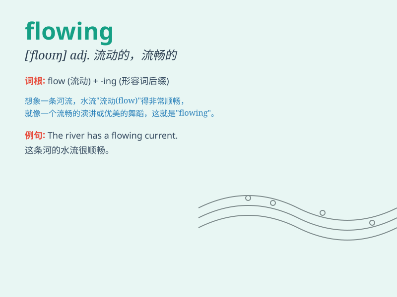

## flowing

**英音:** _[\'fləʊɪŋ]_ **美音:** _[\'floɪŋ]_

**译义:** *adj.流动的,如流的,平滑的,(文章等)流畅的,通顺的*

### 短语

+ **flowing water:** _流水_

+ **flowing hair:** _飘逸的头发_

+ **flowing dress:** _飘逸的连衣裙_

+ **flowing movement:** _流畅的动作_

+ **flowing lines:** _流畅的线条_

### 例句

#### 例句1

> **The river was flowing rapidly after the heavy rain.**

**中文翻译:** 大雨过后，河水水流湍急。

**单词释义:** 流动；流淌

#### 例句2

> **Her long hair was flowing freely in the wind.**

**中文翻译:** 她的长发在风中自由地飘扬。

**单词释义:** 飘动；飘拂

#### 例句3

> **The music was flowing smoothly from the speakers.**

**中文翻译:** 音乐从扬声器中流畅地流淌出来。

**单词释义:** （声音、音乐等）传播；流淌

### 背诵小故事

> A little bird was flying over a river. The water was flowing
smoothly. The bird saw beautiful flowers along the riverbank. The
flowing water and the lovely scene made the bird very happy.

**一只小鸟飞过一条河。河水顺畅地流淌着。小鸟看到河岸上美丽的花朵。流淌的水和可爱的景色让小鸟非常开心。**

### 图义

