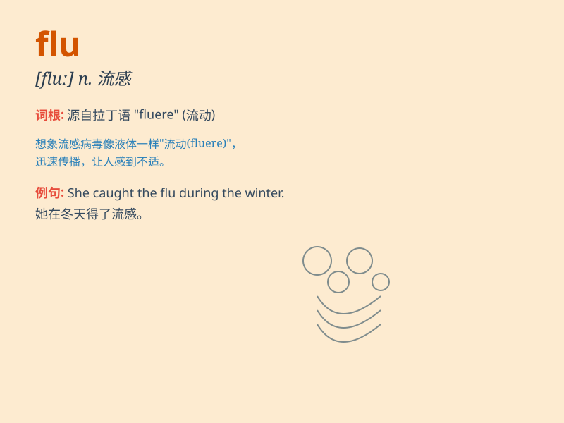

## flu

**英音:** _[fluː]_ **美音:** _[fluː]_

**译义:** *n.流感，流行性感冒*

### 短语

+ **bird flu:** _禽流感_

+ **swine flu:** _猪流感_

+ **flu shot:** _流感疫苗注射_

+ **flu virus:** _流感病毒_

+ **catch the flu:** _患流感_

### 例句

#### 例句1

> **I caught the flu and had to stay in bed for a week.**

**中文翻译:** 我得了流感，不得不卧床一周。

**单词释义:** 流感

#### 例句2

> **The flu virus is highly contagious.**

**中文翻译:** 流感病毒具有高度传染性。

**单词释义:** 流感

#### 例句3

> **She got vaccinated against the flu to prevent getting sick.**

**中文翻译:** 她接种了流感疫苗以防生病。

**单词释义:** 流感

### 背诵小故事

> One day, Lily caught the flu. She felt very weak and had a high
fever. Her friend Tom came to visit and brought her some medicine. After
a few days of rest, Lily finally recovered from the flu.

**有一天，莉莉得了流感。她感到非常虚弱并且发高烧。她的朋友汤姆来看望她并给她带了一些药。几天后，莉莉终于从流感中恢复了。**

### 图义

