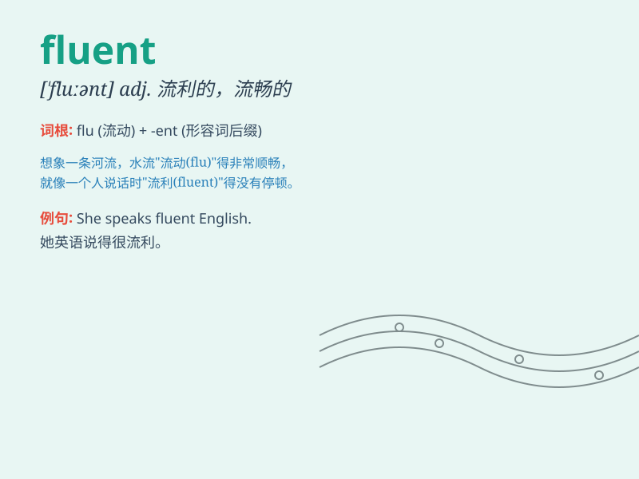

## fluent

**英音:** _[\'fluːənt]_ **美音:** _[\'fluənt]_

**译义:** *adj.流利的,流畅的*

### 短语

+ **fluent in:** _在......方面流利_

+ **fluent speaker:** _流利的演讲者_

+ **fluent language:** _流利的语言_

+ **become fluent:** _变得流利_

+ **remain fluent:** _保持流利_

### 例句

#### 例句1

> **She is fluent in three languages.**

**中文翻译:** 她能流利地说三种语言。

**单词释义:** 流利的

#### 例句2

> **He speaks fluent French.**

**中文翻译:** 他法语说得很流利。

**单词释义:** 流利的

#### 例句3

> **The water flowed in a fluent stream.**

**中文翻译:** 水流畅地流淌着。

**单词释义:** 流畅的

### 背诵小故事

> Once upon a time, there was a student who wanted to speak English
fluently. He practiced every day. Finally, he could express himself
fluently and won a speech contest. Being fluent means speaking smoothly
without any hesitation.

**从前，有个学生想要流利地说英语。他每天练习。最终，他能够流利地表达自己，并赢得了演讲比赛。fluent
意味着流畅地，毫无迟疑地。**

### 图义

