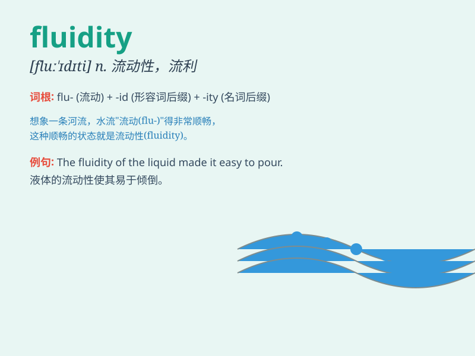

## fluidity

**英音:** _[fluː\'ɪdətɪ]_ **美音:** _[flʊ\'ɪdəti]_

**译义:** *n.流动性,流质,变移性,流度*

### 短语

+ **fluidity of movement:** _动作的流畅性_

+ **emotional fluidity:** _情感的流动性_

+ **market fluidity:** _市场的流动性_

+ **fluidity of thought:** _思维的流畅性_

+ **fluidity of language:** _语言的流畅性_

### 例句

#### 例句1

> **The fluidity of the dancer\'s movements was breathtaking.**

**中文翻译:** 舞者动作的流畅性令人惊叹。

**单词释义:** 流畅性

#### 例句2

> **The fluidity of the market determines the price of the goods.**

**中文翻译:** 市场的流动性决定了商品的价格。

**单词释义:** 流动性

#### 例句3

> **The fluidity of water allows it to flow easily.**

**中文翻译:** 水的流动性使它能够轻易流动。

**单词释义:** 流动性

### 背诵小故事

> Once upon a time, a scientist was studying a special liquid. The
liquid could flow freely and change its shape easily. He called this
property \'fluidity\'. It means the ability to flow smoothly and freely
like that liquid.

**从前，有一位科学家在研究一种特殊的液体。这种液体能够自由流动并且很容易改变形状。他把这种特性称为\'fluidity\'。它意味着像那种液体一样平稳、自由流动的能力。**

### 图义

