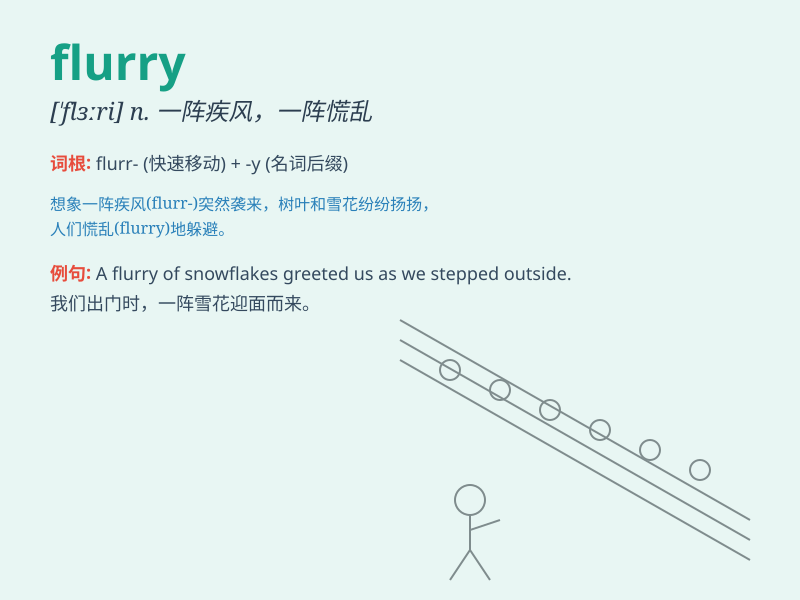

## flurry

**英音:** _[\'flʌrɪ]_ **美音:** _[\'flɝi]_

**译义:** *n.阵风,小雪,小雨,飓风,慌张vt.使恐慌,使狼狈vi.激动,慌张*

### 短语

+ **a flurry of activity:** _一阵繁忙的活动_

+ **in a flurry:** _慌慌张张；匆忙_

+ **flurry of snow:** _一阵雪_

+ **flurry of excitement:** _一阵兴奋_

+ **flurry of emotions:** _一阵情绪波动_

### 例句

#### 例句1

> **A flurry of snowflakes filled the air.**

**中文翻译:** 一阵雪花充满了空气。

**单词释义:** 一阵（雪、雨等）

#### 例句2

> **There was a flurry of activity in the stock market.**

**中文翻译:** 股票市场出现了一阵繁忙的活动。

**单词释义:** 一阵忙乱（的活动）

#### 例句3

> **She received a flurry of phone calls after the news broke.**

**中文翻译:** 消息传出后，她接到了一连串的电话。

**单词释义:** 一连串（的事情）

### 背诵小故事

> One day, I was walking in the park when a sudden flurry of snowflakes
started to fall. They came quickly and filled the air, making everything
look magical. The flurry was short but beautiful.

**有一天，我正在公园散步，突然一阵雪花纷飞而下。它们迅速落下，弥漫在空中，让一切看起来都很神奇。这场纷飞很短暂但很美丽。**

### 图义

