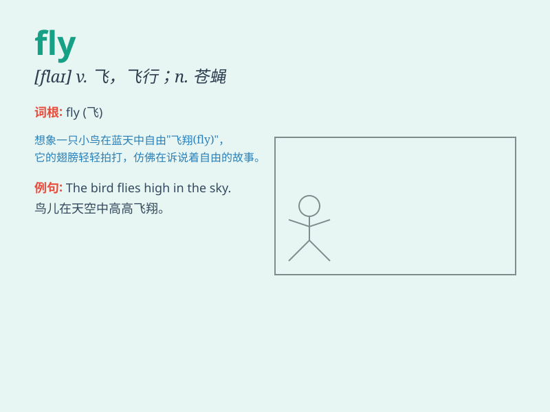

## fly

**英音:** _[flaɪ]_ **美音:** _[flaɪ]_

**译义:**
*n.苍蝇,两翼昆虫,飞行vi.飞翔,飘扬,溃逃vt.飞越,使飘扬,逃脱adj.机敏的,敏捷的*

### 短语

+ **fly a kite:** _放风筝_

+ **fly away:** _飞走；离开_

+ **fly high:** _飞得高；有雄心壮志_

+ **fly into a rage:** _勃然大怒_

+ **time flies:** _时光飞逝_

### 例句

#### 例句1

> **The bird can fly high in the sky.**

**中文翻译:** 这只鸟能在天空中飞得很高。

**单词释义:** 飞

#### 例句2

> **I want to fly to Paris next week.**

**中文翻译:** 我下周想飞去巴黎。

**单词释义:** 乘飞机

#### 例句3

> **The flag is flying in the wind.**

**中文翻译:** 旗帜在风中飘扬。

**单词释义:** 飘扬

### 背诵小故事

> A little bee wanted to fly to the beautiful garden. It practiced hard
and finally could fly freely among the flowers. It felt so happy and
proud.

**一只小蜜蜂想要飞去美丽的花园。它努力练习，最后能够在花丛中自由地飞翔。它感到非常开心和自豪。**

### 图义

