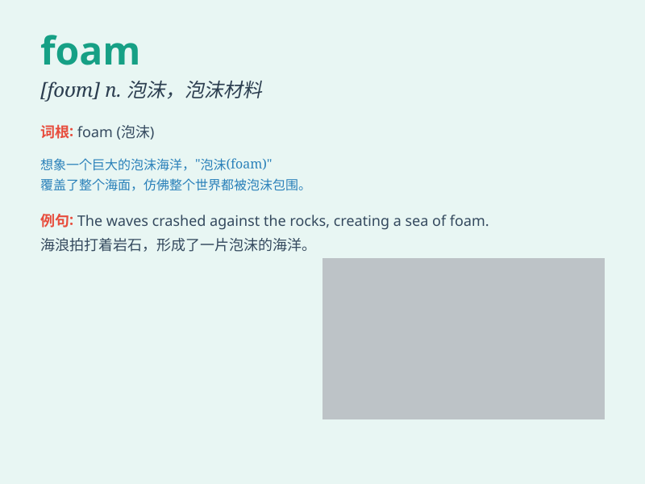

## foam

**英音:** _[fəʊm]_ **美音:** _[fom]_

**译义:**
*n.泡沫,水沫,泡沫材料,泡沫橡皮,泡沫塑料vi.起泡沫,冒汗水,吐白沫vt.使起泡沫*

### 短语

+ **foam rubber:** _泡沫橡胶_

+ **foam at the mouth:** _口吐白沫；非常愤怒_

+ **foam party:** _泡沫派对_

+ **shaving foam:** _剃须泡沫_

+ **fire foam:** _灭火泡沫_

### 例句

#### 例句1

> **The waves crashed onto the shore, leaving foam behind.**

**中文翻译:** 海浪拍打着海岸，留下了泡沫。

**单词释义:** 泡沫

#### 例句2

> **The beer was filled with foam at the top of the glass.**

**中文翻译:** 玻璃杯顶部的啤酒充满了泡沫。

**单词释义:** 泡沫

#### 例句3

> **She was so angry that her words came out in a foam of rage.**

**中文翻译:** 她非常生气，以至于愤怒的话语像泡沫一样涌出。

**单词释义:** 泡沫（比喻愤怒时的言语）

### 背诵小故事

> One day, I was at the beach and saw the waves crashing. When they
broke, they created a lot of foam. It looked like white bubbles dancing
on the surface of the water. The foam was so light and fluffy.

**有一天，我在海滩，看到海浪拍打着海岸。当海浪破碎时，产生了许多泡沫。它看起来就像白色的泡泡在水面上跳舞。这些泡沫又轻又蓬松。**

### 图义

