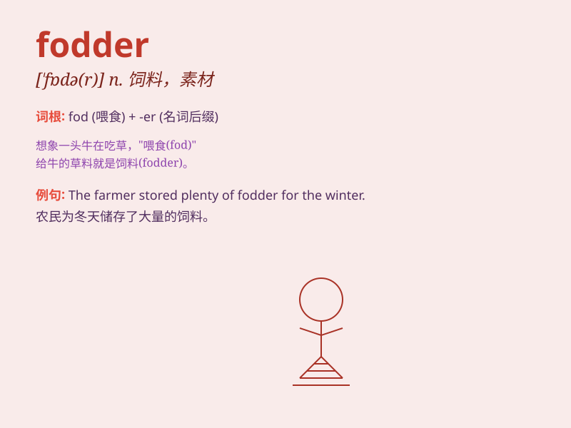

## fodder

**英音:** _[\'fɒdə]_ **美音:** _[\'fɑdɚ]_

**译义:** *n.饲料,草料,(创作的)素材,弹药vt.喂*

### 短语

+ **animal fodder:** _动物饲料_

+ **fodder crop:** _饲料作物_

+ **make fodder:** _制作饲料_

+ **fodder storage:** _饲料储存_

+ **poor quality fodder:** _劣质饲料_

### 例句

#### 例句1

> **The hay is used as fodder for the cattle.**

**中文翻译:** 这些干草被用作牛的饲料。

**单词释义:** 饲料

#### 例句2

> **The soldiers were regarded as mere fodder for the war
machine.**

**中文翻译:** 士兵们被视为战争机器的纯粹炮灰。

**单词释义:** 炮灰；牺牲品

#### 例句3

> **This book provides useful fodder for thought.**

**中文翻译:** 这本书为思考提供了有用的素材。

**单词释义:** 素材；材料

### 背诵小故事

> A farmer was always worried about having enough fodder for his cows
in winter. One day, he stored a large amount of hay as fodder. When
winter came, the cows had plenty to eat and were happy. The farmer was
relieved.

**一位农民总是担心冬天没有足够的饲料给他的奶牛。有一天，他储存了大量的干草作为饲料。当冬天来临时，奶牛有充足的食物吃，很开心。农民也松了一口气。**

### 图义

