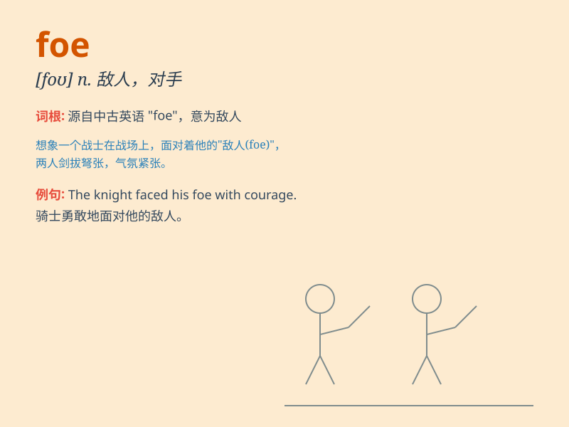

## foe

**英音:** _[fəʊ]_ **美音:** _[fo]_

**译义:** *n.反对者,敌人,危害物*

### 短语

+ **arch foe:** _主要敌人；头号敌人_

+ **sworn foe:** _不共戴天的敌人_

+ **mortal foe:** _死敌；致命的敌人_

+ **deadly foe:** _致命的敌人_

+ **implacable foe:** _无法平息的敌人；难以和解的敌人_

### 例句

#### 例句1

> **He saw his foe approaching and prepared for battle.**

**中文翻译:** 他看到他的敌人正在靠近并准备战斗。

**单词释义:** 敌人

#### 例句2

> **The superhero always defeats his foes with his special
powers.**

**中文翻译:** 这位超级英雄总是用他的特殊能力打败他的敌人。

**单词释义:** 敌人

#### 例句3

> **She regarded him as a foe rather than a friend.**

**中文翻译:** 她把他当作敌人而不是朋友。

**单词释义:** 敌人

### 背诵小故事

> In a magical forest, a brave knight encountered a fierce dragon. The
dragon was the knight\'s foe. They fought fiercely. The knight finally
defeated the foe and saved the forest.

**在一个神奇的森林里，一位勇敢的骑士遇到了一只凶猛的龙。这只龙是骑士的敌人。他们激烈地战斗。骑士最终打败了敌人并拯救了森林。**

### 图义

