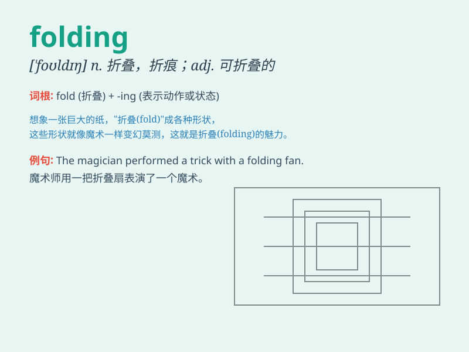

## folding

**英音:** _[\'fəʊldɪŋ]_ **美音:** _[\'foldɪŋ]_

**译义:** *adj.可折叠的*

### 短语

+ **folding chair:** _折叠椅_

+ **folding bike:** _折叠自行车_

+ **folding table:** _折叠桌_

+ **folding knife:** _折叠刀_

+ **folding screen:** _折叠屏风_

### 例句

#### 例句1

> **The folding chair is very convenient for outdoor activities.**

**中文翻译:** 这把折叠椅对于户外活动非常方便。

**单词释义:** 折叠的（形容椅子）

#### 例句2

> **She was busy folding the clothes neatly.**

**中文翻译:** 她正忙着把衣服整齐地叠起来。

**单词释义:** 折叠（动词，指叠衣服这个动作）

#### 例句3

> **The folding bike can be easily carried on the bus.**

**中文翻译:** 这辆折叠自行车可以很容易地带上公交车。

**单词释义:** 折叠的（形容自行车）

### 背诵小故事

> One day, I was at a fair and saw a man doing amazing folding tricks
with paper. He could turn a flat sheet into various shapes like a bird
or a flower. The act of folding was so fascinating!

**有一天，我在集市上看到一个人用纸做令人惊叹的折叠技巧。他能把一张平纸折成各种形状，像鸟或花。折叠这个动作太迷人了！**

### 图义

