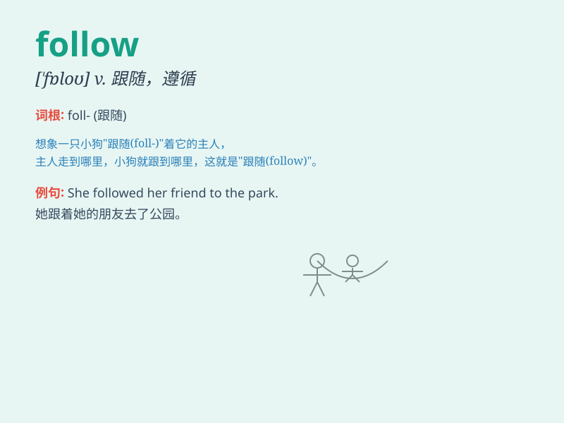

## follow

**英音:** _[\'fɒləʊ]_ **美音:** _[\'fɑlo]_

**译义:**
*vt.跟随,追随,沿\...而行,理解,遵循,从事,追求,注视vi.跟随,接着n.跟随,追随*

### 短语

+ **follow up:** _采取后续行动；追查；跟进_

+ **follow through:** _坚持到底；完成（计划或行动等）_

+ **follow suit:** _跟着做；仿效_

+ **follow the crowd:** _随大流；从众_

+ **follow one\'s heart:** _听从内心；随心而行_

### 例句

#### 例句1

> **Please follow me.**

**中文翻译:** 请跟着我。

**单词释义:** 跟随

#### 例句2

> **The story follows the adventures of a young girl.**

**中文翻译:** 这个故事讲述了一个年轻女孩的冒险经历。

**单词释义:** 叙述；以\...为线索

#### 例句3

> **If you follow these instructions, you should have no problem.**

**中文翻译:** 如果你遵循这些指示，你应该不会有问题。

**单词释义:** 遵循；听从

### 背诵小故事

> One day, a little puppy was following its owner on a walk. It kept
close behind, never straying away. The puppy\'s action of staying close
and going after its owner is like the meaning of \'follow\'.

**有一天，一只小狗在散步时跟着它的主人。它紧紧跟在后面，从不偏离。小狗紧跟主人的行为就像'follow'这个单词的意思。**

### 图义

