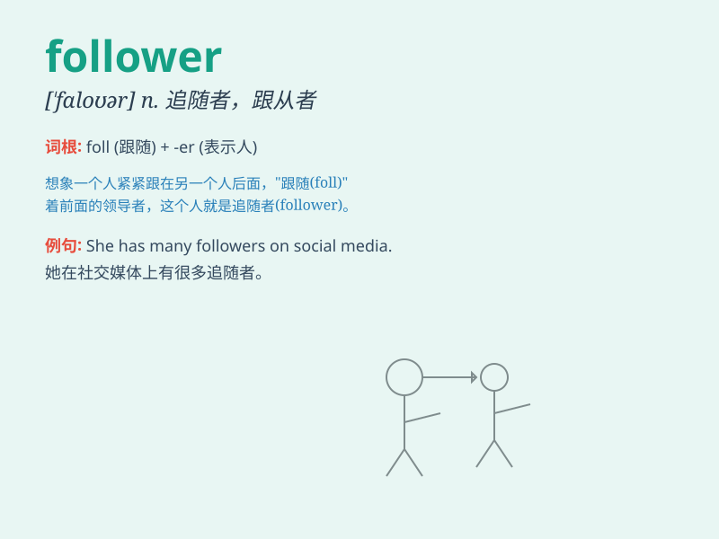

## follower

**英音:** _[\'fɒləʊə]_ **美音:** _[\'fɑloɚ]_

**译义:** *n.追随者,信徒*

### 短语

+ **follower of fashion:** _赶时髦的人_

+ **devoted follower:** _忠实的追随者_

+ **religious follower:** _宗教信徒_

+ **political follower:** _政治追随者_

+ **ardent follower:** _热情的追随者_

### 例句

#### 例句1

> **She has a large number of followers on social media.**

**中文翻译:** 她在社交媒体上有大量的追随者。

**单词释义:** 追随者；拥护者

#### 例句2

> **The leader was followed by a group of followers.**

**中文翻译:** 这位领导人后面跟着一群追随者。

**单词释义:** 追随者；随从

#### 例句3

> **He is a devoted follower of this football team.**

**中文翻译:** 他是这支足球队的忠实追随者。

**单词释义:** 追随者；拥护者

### 背诵小故事

> One day, a famous singer was giving a concert. There were many people
in the audience. Among them, Tom was a passionate follower. He knew
every song and sang along loudly. The singer was deeply touched by
Tom\'s enthusiasm.

**一天，一位著名的歌手正在举办演唱会。观众中有很多人。其中，汤姆是一位热情的追随者。他知道每一首歌并且大声跟着唱。歌手被汤姆的热情深深打动了。**

### 图义

