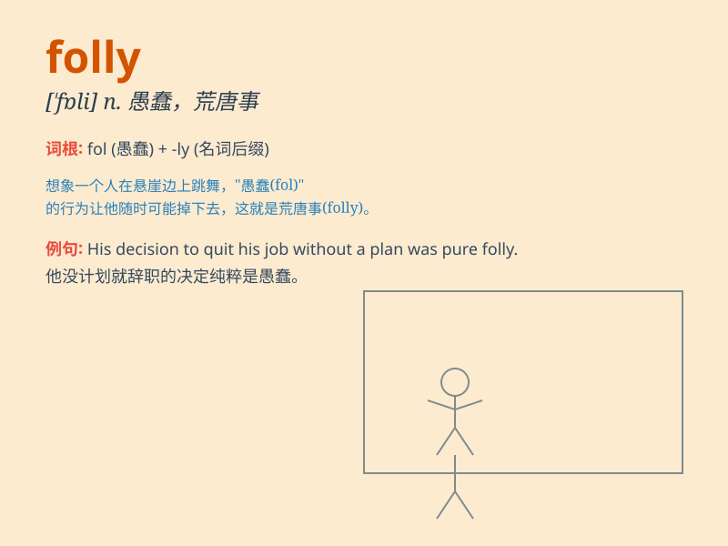

## folly

**英音:** _[\'fɒlɪ]_ **美音:** _[\'fɑli]_

**译义:**
*n.愚蠢,荒唐事,轻松歌舞剧,讽刺剧,傻念头,傻话,耗费巨大而又无益的事,\<古>放荡*

### 短语

+ **commit a folly:** _干蠢事_

+ **the follies of youth:** _年轻人的荒唐事_

+ **architectural folly:** _装饰性建筑；没有实际用途的建筑_

+ **folly of doing sth:** _做某事的愚蠢行为_

+ **in folly:** _愚蠢地；愚笨地_

### 例句

#### 例句1

> **It was folly to think that he could escape unnoticed.**

**中文翻译:** 认为他能不被注意地逃跑是愚蠢的想法。

**单词释义:** 愚蠢；愚行

#### 例句2

> **The folly of his actions became apparent only later.**

**中文翻译:** 他行为的愚蠢之处后来才变得明显。

**单词释义:** 愚蠢的行为；蠢事

#### 例句3

> **She realized the folly of her decision to quit her job without
having another one lined up.**

**中文翻译:**
她意识到自己在没有找到另一份工作之前就辞职的决定是愚蠢的。

**单词释义:** 愚蠢；不明智

### 背诵小故事

> A rich man decided to build a huge and unnecessary tower. Everyone
told him it was a folly. But he didn\'t listen. In the end, he wasted
all his money. The tower became a symbol of his foolish decision.

**一个有钱人决定建造一座巨大且没必要的塔。每个人都告诉他这是愚蠢的行为。但他不听。最后，他浪费了所有的钱。这座塔成了他愚蠢决定的象征。**

### 图义

