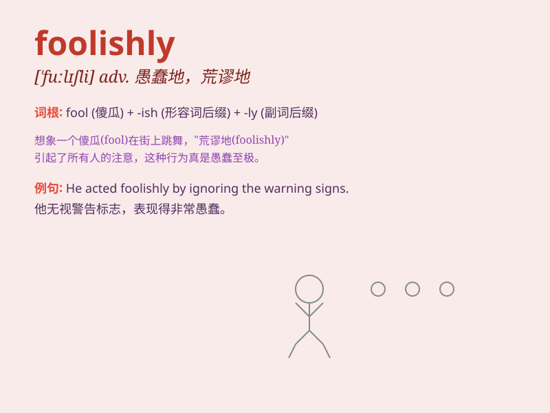

## foolishly

**英音:** _[\'fuːlɪʃli]_ **美音:** _[\'fuːlɪʃli]_

**译义:** *adv.愚笨地,无聊地*

### 短语

+ **act foolishly:** _行为愚蠢_

+ **speak foolishly:** _说话愚蠢_

+ **behave foolishly:** _表现愚蠢_

+ **think foolishly:** _想法愚蠢_

+ **do something foolishly:** _愚蠢地做某事_

### 例句

#### 例句1

> **He foolishly spent all his money on gambling.**

**中文翻译:** 他愚蠢地把所有的钱都花在了赌博上。

**单词释义:** 愚蠢地

#### 例句2

> **She foolishly trusted the stranger without any caution.**

**中文翻译:** 她愚蠢地毫无警惕地信任了那个陌生人。

**单词释义:** 愚蠢地

#### 例句3

> **They foolishly underestimated the difficulty of the task.**

**中文翻译:** 他们愚蠢地低估了这项任务的难度。

**单词释义:** 愚蠢地

### 背诵小故事

> A man foolishly decided to climb a tall tree without any safety
equipment. He slipped and fell, hurting himself. This shows that acting
foolishly can lead to bad consequences.

**一个男人愚蠢地决定在没有任何安全设备的情况下爬一棵高大的树。他滑倒并摔了下来，伤到了自己。这表明愚蠢地行事会导致不良后果。**

### 图义

