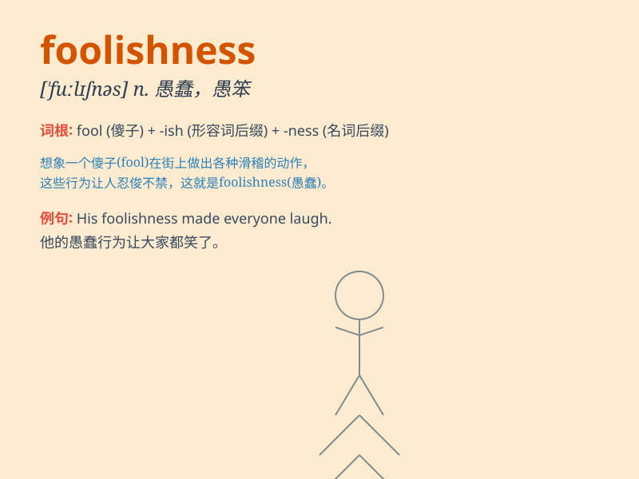

## foolishness

**英音:** _[ˈfuːlɪʃnəs]_ **美音:** _[ˈfuːlɪʃnəs]_

**译义:** *n.愚蠢；可笑*

### 短语

+ **act of foolishness:** _愚蠢的行为_

+ **state of foolishness:** _愚蠢的状态_

+ **avoid foolishness:** _避免愚蠢_

+ **commit foolishness:** _做出愚蠢的事_

+ **indulge in foolishness:** _沉溺于愚蠢_

### 例句

#### 例句1

> **His foolishness led him to make a big mistake in the business
deal.**

**中文翻译:** 他的愚蠢导致他在这笔生意中犯了一个大错。

**单词释义:** 愚蠢；愚笨

#### 例句2

> **I can\'t believe the foolishness of some people when it comes to
safety.**

**中文翻译:** 我真不敢相信有些人在安全问题上的愚蠢。

**单词释义:** 愚蠢的行为

#### 例句3

> **The foolishness of her decision cost her a lot of
opportunities.**

**中文翻译:** 她决定的愚蠢使她失去了很多机会。

**单词释义:** 不明智；傻气

### 背诵小故事

> Once upon a time, there was a man who always made silly decisions.
His actions showed his foolishness. For example, he tried to catch a
bird with his bare hands. People laughed at him for his lack of wisdom.

**从前，有一个人总是做愚蠢的决定。他的行为显示出他的愚蠢。比如，他试图徒手抓鸟。人们嘲笑他缺乏智慧。**

### 图义

