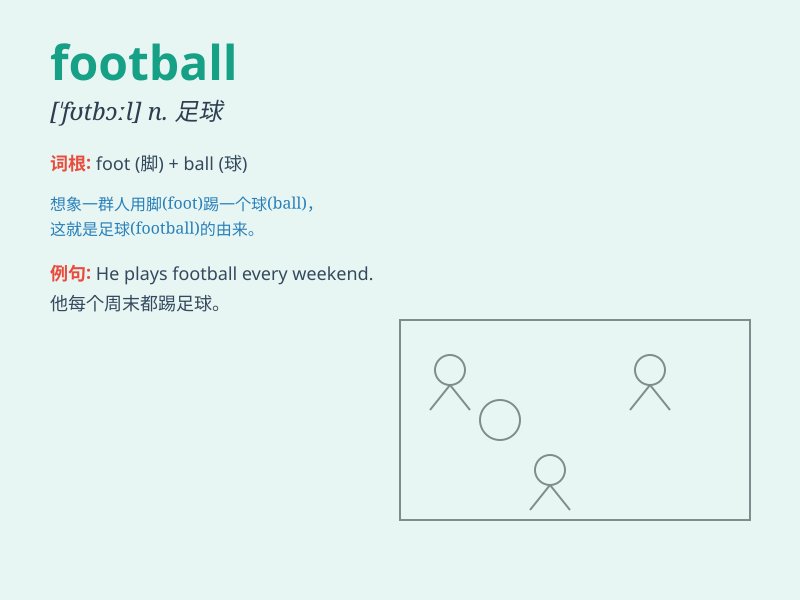

## football

**英音:** _[\'fʊtbɔːl]_ **美音:** _[\'fʊtbɔl]_

**译义:** *n.足球,橄榄球*

### 短语

+ **play football:** _踢足球_

+ **football match:** _足球比赛_

+ **football team:** _足球队_

+ **football field:** _足球场_

+ **football fan:** _足球迷_

### 例句

#### 例句1

> **I love playing football on weekends.**

**中文翻译:** 我喜欢在周末踢足球。

**单词释义:** 足球

#### 例句2

> **The football match attracted thousands of spectators.**

**中文翻译:** 这场足球比赛吸引了数千名观众。

**单词释义:** 足球

#### 例句3

> **He is a professional football player.**

**中文翻译:** 他是一名职业足球运动员。

**单词释义:** 足球

### 背诵小故事

> One day, Tom and his friends went to a big field. They had a
wonderful time playing football. They ran, kicked the ball, and scored
goals. It was so much fun and they all loved this sport.

**有一天，汤姆和他的朋友们去了一个大场地。他们踢足球玩得非常开心。他们奔跑、踢球、射门。太有趣了，他们都热爱这项运动。**

### 图义

