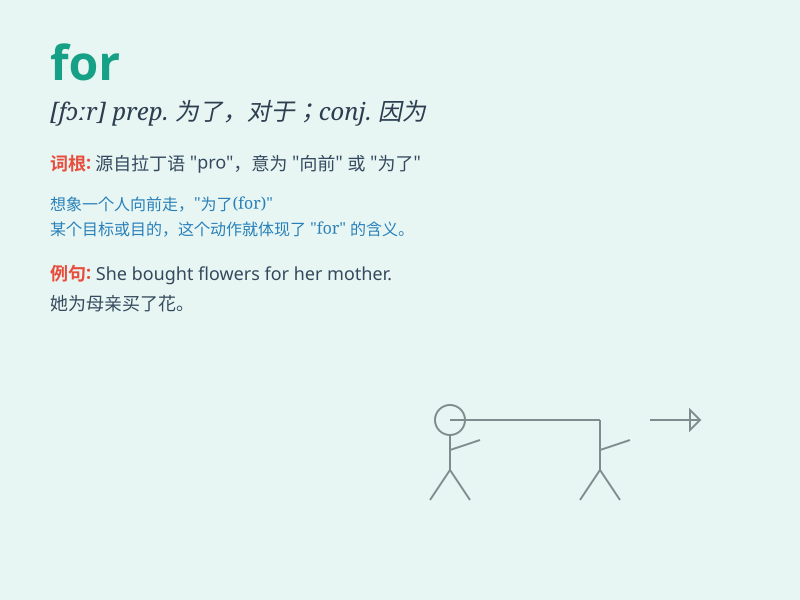

## for

**英音:** _[fɔː(r)]_ **美音:** _[fə(r)]_

**译义:** * prep.(表示目的)为了,因为,至于,对于,适合于 conj.因为*

### 短语

+ **for example:** _例如；比如_

+ **for sure:** _肯定；毫无疑问_

+ **for ever:** _永远；老是_

+ **for the moment:** _暂时；目前_

+ **for good:** _永远；永久_

### 例句

#### 例句1

> **I\'m studying hard for the exam.**

**中文翻译:** 我正在努力学习准备考试。

**单词释义:** 为了

#### 例句2

> **She bought a new dress for the party.**

**中文翻译:** 她为聚会买了一件新衣服。

**单词释义:** 为了

#### 例句3

> **He has been waiting for an hour.**

**中文翻译:** 他已经等了一个小时了。

**单词释义:** 达；计

### 背诵小故事

> A little boy was very hungry. He went to the kitchen and found some
cookies. His mom said, \'These are for you.\' The word \'for\' here
means intended to be given to or used by someone.

**一个小男孩非常饿。他去厨房发现了一些饼干。他妈妈说：'这些是给你的。'这里的'for'表示打算给某人或供某人使用。**

### 图义

