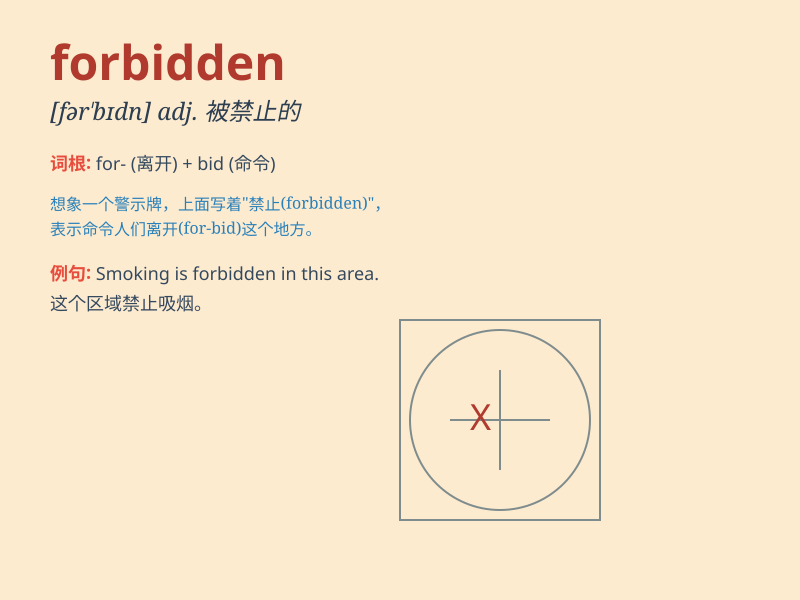

## forbidden

**英音:** _[fə\'bɪd(ə)n]_ **美音:** _[fɚ\'bɪdn]_

**译义:** *adj.禁止的,严禁的 vbl.forbid的过去分词*

### 短语

+ **forbidden fruit:** _禁果；因被禁止反而更想得到的东西_

+ **forbidden zone:** _禁区；禁止进入的地区_

+ **forbidden love:** _禁忌之爱；不被允许的爱情_

+ **forbidden city:** _紫禁城_

+ **forbidden area:** _禁区；禁止区域_

### 例句

#### 例句1

> **Smoking is forbidden in this building.**

**中文翻译:** 这栋大楼内禁止吸烟。

**单词释义:** 被禁止的

#### 例句2

> **The use of mobile phones is forbidden during the exam.**

**中文翻译:** 考试期间禁止使用手机。

**单词释义:** 被禁止的

#### 例句3

> **It is forbidden to enter the restricted area without
permission.**

**中文翻译:** 未经许可，禁止进入禁区。

**单词释义:** 被禁止的

### 背诵小故事

> In a magical forest, there was a hidden cave. A powerful spell made
it forbidden to enter. One brave adventurer ignored the warning and
faced dangerous magic. Remember, \'forbidden\' means not allowed or
prohibited.

**在一个神奇的森林里，有一个隐藏的洞穴。一个强大的咒语使其禁止进入。一位勇敢的冒险家无视警告，遭遇了危险的魔法。记住，\'forbidden\'意思是不被允许或禁止。**

### 图义

