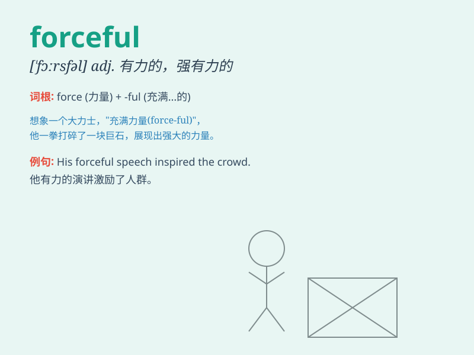

## forceful

**英音:** _[\'fɔːsfʊl; -f(ə)l]_ **美音:** _[\'fɔrsfl]_

**译义:** *adj.有力的,有说服力的*

### 短语

+ **forceful personality:** _强有力的个性_

+ **forceful argument:** _有力的论点_

+ **forceful leadership:** _强有力的领导_

+ **forceful action:** _有力的行动_

+ **forceful speech:** _有力的演讲_

### 例句

#### 例句1

> **He made a forceful argument to support his point of view.**

**中文翻译:** 他提出了有力的论据来支持他的观点。

**单词释义:** 强有力的

#### 例句2

> **The leader\'s speech was forceful and inspiring.**

**中文翻译:** 领导的讲话铿锵有力，鼓舞人心。

**单词释义:** 有力的

#### 例句3

> **She has a forceful personality that makes her stand out in the
crowd.**

**中文翻译:** 她的性格十分强势，在人群中显得格外引人注目。

**单词释义:** 坚强的

### 背诵小故事

> A strong wind was blowing. It was so forceful that it pushed over the
small trees. Just like a powerful athlete, the wind showed its forceful
nature.

**一阵强风在吹。它非常有力，以至于把小树都吹倒了。就像一个强大的运动员，这风展现出了它强有力的特质。**

### 图义

