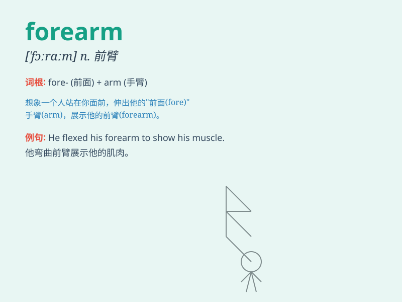

## forearm

**英音:** _[ˈfɔːrɑːm , ˌfɔːrˈɑːm]_ **美音:** _[ˈfɔːrɑːrm ,
ˌfɔːrˈɑːrm]_

**译义:** *n.前臂vt.准备战斗,预先武装,准备*

### 短语

+ **forearm muscle:** _前臂肌肉_

+ **forearm injury:** _前臂损伤_

+ **strong forearm:** _强壮的前臂_

+ **forearm exercise:** _前臂锻炼_

+ **forearm grip:** _前臂抓握_

### 例句

#### 例句1

> **He injured his forearm while playing tennis.**

**中文翻译:** 他在打网球时弄伤了前臂。

**单词释义:** 前臂

#### 例句2

> **The tattoo on her forearm was very beautiful.**

**中文翻译:** 她前臂上的纹身非常漂亮。

**单词释义:** 前臂

#### 例句3

> **The boxer strengthened his forearm muscles for better
punches.**

**中文翻译:** 这位拳击手加强了前臂肌肉，以便更好地出拳。

**单词释义:** 前臂

### 背诵小故事

> One day, a brave knight was in a fierce battle. His enemy aimed a
sword at his forearm. But the knight protected his forearm and won the
fight. Remember, forearm is the part from the elbow to the wrist.

**有一天，一位勇敢的骑士在激烈的战斗中。他的敌人将剑刺向他的前臂。但骑士保护住了他的前臂并赢得了战斗。记住，forearm
就是从肘部到手腕的部分。**

### 图义

