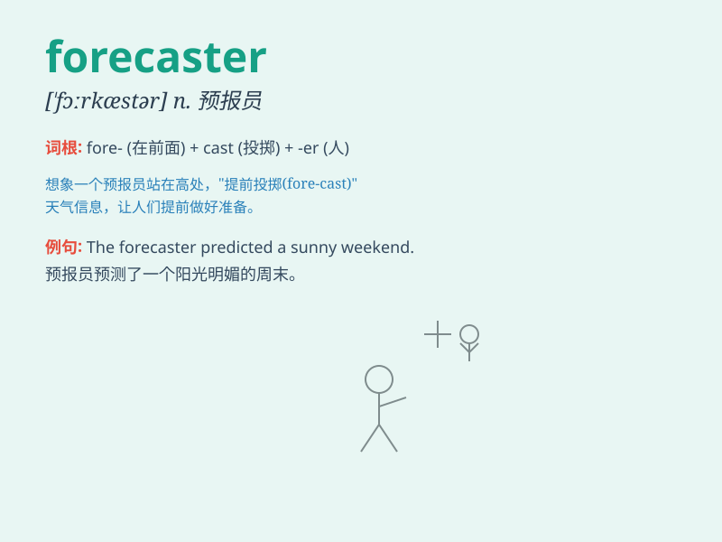

## forecaster

**英音:** _[\'fɔːkɑːstə]_ **美音:** _[\'fɔrkæstɚ]_

**译义:** *n.预报员*

### 短语

+ **weather forecaster:** _天气预报员_

+ **economic forecaster:** _经济预测师_

+ **market forecaster:** _市场预测者_

+ **sales forecaster:** _销售预测员_

+ **stock market forecaster:** _股市预测家_

### 例句

#### 例句1

> **The weather forecaster predicted rain for tomorrow.**

**中文翻译:** 天气预报员预测明天会下雨。

**单词释义:** 预报员；预测者

#### 例句2

> **The economic forecaster warned of a potential recession.**

**中文翻译:** 经济预测人士警告称，经济可能出现衰退。

**单词释义:** 预测者；预报员

#### 例句3

> **The sports forecaster anticipated a close game between the two
teams.**

**中文翻译:** 体育预报员预计两队之间将会有一场势均力敌的比赛。

**单词释义:** 预测者；预报员

### 背诵小故事

> One day, a wise old man was known as the forecaster. He could predict
the weather accurately. People always came to him for advice before
going on trips. His forecasts helped them prepare well.

**有一天，一位睿智的老人被称为预报员。他能准确地预测天气。人们在旅行前总是来找他寻求建议。他的预报帮助他们做好准备。**

### 图义

