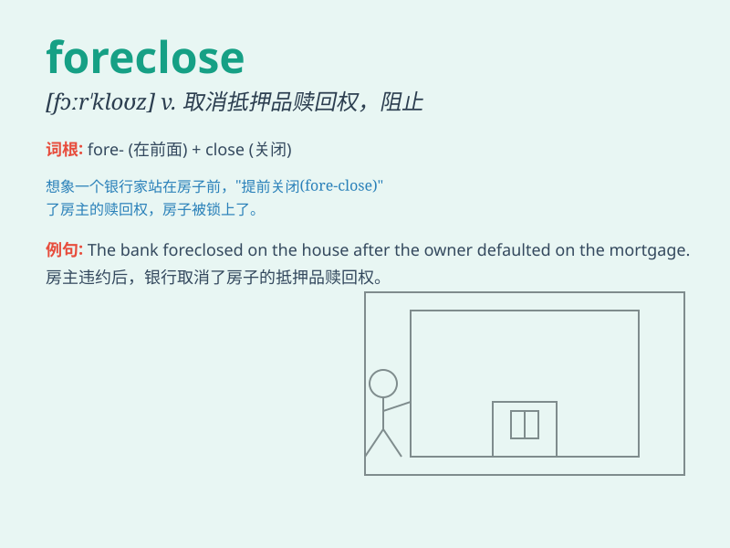

## foreclose

**英音:** _[fɔː\'kləʊz]_ **美音:** _[fɔr\'kloz]_

**译义:**
*vt.排除在外,妨碍,自称,阻止,预先处理,取消抵押品赎回权vi.[律]取消抵押品赎回权*

### 短语

+ **foreclose on:** _取消抵押品赎回权；剥夺......的抵押品赎回权_

+ **foreclose a loan:** _取消贷款_

+ **foreclose the possibility:** _排除可能性_

+ **foreclose all options:** _排除所有选择_

+ **foreclose further discussion:** _终止进一步的讨论_

### 例句

#### 例句1

> **The bank threatened to foreclose on the mortgage if the payments
were not made on time.**

**中文翻译:** 银行威胁称，如果不按时付款，将取消抵押贷款的赎回权。

**单词释义:** 取消（抵押品）赎回权

#### 例句2

> **He was in danger of having his home foreclosed due to his
debts.**

**中文翻译:** 由于债务，他的房屋面临被取消赎回权的危险。

**单词释义:** 取消（房产等的）赎回权

#### 例句3

> **The lender has the right to foreclose if the borrower defaults on
the loan.**

**中文翻译:** 如果借款人拖欠贷款，贷款人有权取消抵押品赎回权。

**单词释义:** 取消赎回权

### 背诵小故事

>
想象一个银行，它总是在房子主人不能按时还钱时，强行提前终止贷款并收回房子，这就是\'foreclose\'。就好像银行关闭了主人拥有房子的大门。

**（因抵押人未如期还贷）取消（抵押人的）赎回权；排除；阻止**

### 图义

