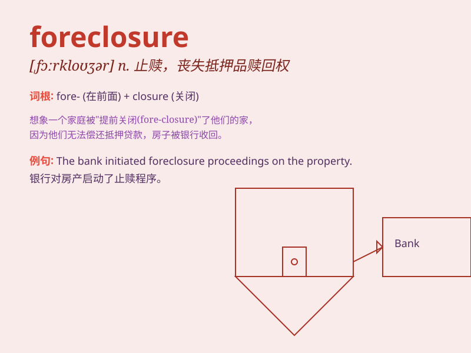

## foreclosure

**英音:** _[fɔː\'kləʊʒə]_ **美音:** _[fɔr\'kloʒɚ]_

**译义:** *n.丧失抵押品赎回权,排斥*

### 短语

+ **foreclosure notice:** _止赎通知_

+ **foreclosure process:** _止赎程序_

+ **foreclosure sale:** _止赎拍卖_

+ **avoid foreclosure:** _避免止赎_

+ **foreclosure threat:** _止赎威胁_

### 例句

#### 例句1

> **The bank initiated foreclosure proceedings against the delinquent
borrower.**

**中文翻译:** 该银行对拖欠借款人启动了取消抵押品赎回权的程序。

**单词释义:** 止赎；丧失抵押品赎回权

#### 例句2

> **Foreclosure on his house left him homeless.**

**中文翻译:** 房屋丧失抵押品赎回权使他无家可归。

**单词释义:** 止赎

#### 例句3

> **The threat of foreclosure forced him to find a way to pay off his
debts quickly.**

**中文翻译:** 丧失抵押品赎回权的威胁迫使他寻找快速偿还债务的方法。

**单词释义:** 止赎

### 背诵小故事

> A man was always in debt. The bank decided on foreclosure of his
house. He lost his home and felt very sad. Remember, foreclosure means
taking away property due to unpaid debts.

**一个男人总是负债。银行决定对他的房子进行止赎。他失去了房子，非常伤心。记住，foreclosure
意思是因未偿还债务而夺走财产。**

### 图义

