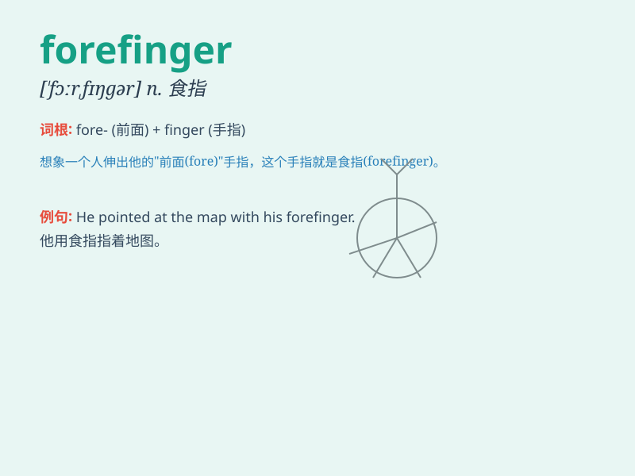

## forefinger

**英音:** _[\'fɔːfɪŋgə]_ **美音:** _[\'fɔrfɪŋɡɚ]_

**译义:** *n.食指*

### 短语

+ **point with the forefinger:** _用食指指_

+ **forefinger tip:** _食指尖_

+ **forefinger joint:** _食指关节_

+ **extend the forefinger:** _伸出食指_

+ **touch with the forefinger:** _用食指触摸_

### 例句

#### 例句1

> **She pointed to the map with her forefinger.**

**中文翻译:** 她用食指指着地图。

**单词释义:** 食指

#### 例句2

> **He raised his forefinger to emphasize his point.**

**中文翻译:** 他举起食指强调他的观点。

**单词释义:** 食指

#### 例句3

> **The child sucked on his forefinger.**

**中文翻译:** 孩子吮吸了他的食指。

**单词释义:** 食指

### 背诵小故事

> One day, a little boy was pointing at a beautiful butterfly with his
forefinger. He was so excited and wanted to show it to his friends. The
forefinger was like a magic wand, guiding their attention.

**有一天，一个小男孩用他的食指指着一只漂亮的蝴蝶。他非常兴奋，想要指给他的朋友们看。食指就像一根魔法棒，引导着他们的注意力。**

### 图义

