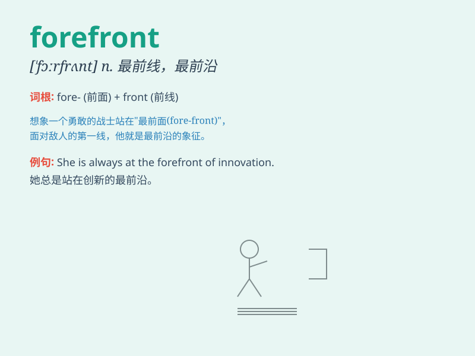

## forefront

**英音:** _[\'fɔːfrʌnt]_ **美音:** _[\'fɔrfrʌnt]_

**译义:** *n.最前部,最前线,最活动的中心*

### 短语

+ **in the forefront:** _处于最前列；在前沿_

+ **at the forefront:** _在最前沿；处于领先地位_

+ **come to the forefront:** _走到前列；变得突出_

+ **be at the forefront of:**
_处于......的前沿；在......的最前端_

+ **push to the forefront:** _推到前沿；使处于突出位置_

### 例句

#### 例句1

> **She is at the forefront of the fight against climate change.**

**中文翻译:** 她站在应对气候变化的最前线。

**单词释义:** 前沿；前列

#### 例句2

> **The new technology has brought this company to the forefront of
the industry.**

**中文翻译:** 新技术使该公司走在了行业的前列。

**单词释义:** 前沿；最前列

#### 例句3

> **He was always in the forefront of scientific research.**

**中文翻译:** 他始终走在科学研究的最前沿。

**单词释义:** 最前列；前沿

### 背诵小故事

>
在一场激烈的科技竞赛中，小明总是站在最前方（forefront），引领团队探索未知。他就像勇敢的先锋，冲在前沿，为大家开辟道路，最终带领团队取得成功。

**在一场科技竞赛中，小明总是处于最前沿，引领团队并最终成功。**

### 图义

