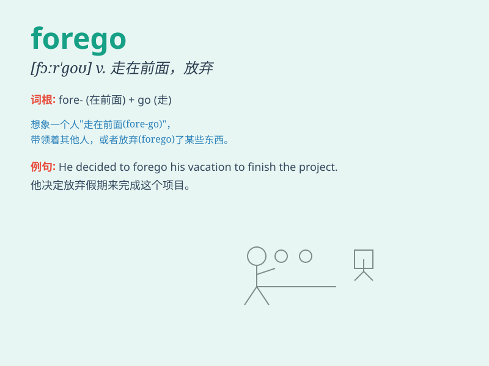

## forego

**英音:** _[fɔːˈɡəʊ]_ **美音:** _[fɔːrˈɡoʊ]_

**译义:** *vt.(在位置时间或程度方面)走在\...之前,居先*

### 短语

+ **forego breakfast:** _不吃早餐_

+ **forego an opportunity:** _放弃一个机会_

+ **forego pleasure:** _放弃快乐_

+ **forego the right:** _放弃权利_

+ **forego a trip:** _取消一次旅行_

### 例句

#### 例句1

> **He had to forego his vacation to finish the project on time.**

**中文翻译:** 他不得不放弃假期才能按时完成该项目。

**单词释义:** 放弃

#### 例句2

> **She decided to forego the party and stay home to study.**

**中文翻译:** 她决定放弃聚会，留在家里学习。

**单词释义:** 舍弃

#### 例句3

> **We had to forego the luxury of a new car for now.**

**中文翻译:** 我们现在不得不放弃新车的奢华。

**单词释义:** 摒弃

### 背诵小故事

> A brave explorer decided to forego the easy path and take on the
challenging one in the jungle. He gave up the comfort to seek greater
adventure. \'Forego\' means to go before or do without.

**一位勇敢的探险家决定放弃容易的道路，在丛林中选择具有挑战性的那条。他舍弃了舒适去寻求更大的冒险。\'forego\'意思是走在前面；放弃**

### 图义

