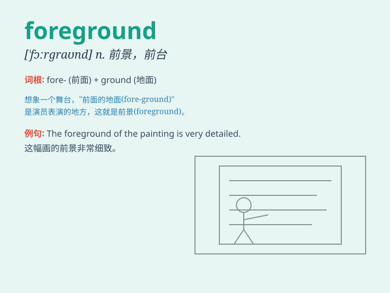

## foreground

**英音:** _[\'fɔːgraʊnd]_ **美音:** _[\'fɔrɡraʊnd]_

**译义:** *n.前景,最显著的位置*

### 短语

+ **in the foreground:** _在前景中；在显著地位_

+ **bring into the foreground:** _使突出；使成为重点_

+ **foreground color:** _前景色_

+ **foreground processing:** _前台处理_

+ **foreground object:** _前景对象_

### 例句

#### 例句1

> **The flowers in the foreground are very beautiful.**

**中文翻译:** 前景中的花朵非常美丽。

**单词释义:** 前景；最显著的位置

#### 例句2

> **He always likes to put himself in the foreground.**

**中文翻译:** 他总是喜欢把自己放在前台。

**单词释义:** 突出的位置；受关注的地方

#### 例句3

> **The figures in the foreground of the painting are very vivid.**

**中文翻译:** 这幅画前景中的人物非常生动。

**单词释义:** 前景；前部

### 背诵小故事

> 想象你在拍照，镜头前那鲜明突出、一眼就能看到的美丽花朵就是
foreground（前景）。而远处的背景则被虚化，前景的花朵格外引人注目，就像这个单词所表达的处于显眼位置的部分。

**想象拍照时镜头前显眼的部分就是\'前景\'，帮助理解这个单词**

### 图义

