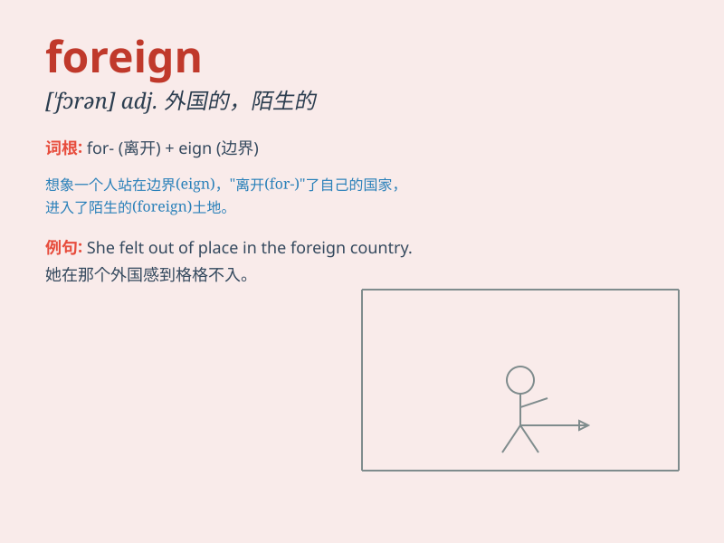

## foreign

**英音:** _[\'fɒrɪn]_ **美音:** _[\'fɔrən]_

**译义:**
*adj.外国的,外交的,外国产的,外来的,[医]异质的,不相关的*

### 短语

+ **foreign language:** _外语_

+ **foreign country:** _外国_

+ **foreign affairs:** _外交事务_

+ **foreign trade:** _对外贸易_

+ **foreign policy:** _外交政策_

### 例句

#### 例句1

> **The company has many foreign clients.**

**中文翻译:** 公司拥有众多国外客户。

**单词释义:** 外国的

#### 例句2

> **She is interested in foreign cultures.**

**中文翻译:** 她对外国文化感兴趣。

**单词释义:** 外国的

#### 例句3

> **The foreign policy of this country needs to be adjusted.**

**中文翻译:** 这个国家的外交政策需要调整。

**单词释义:** 外交的

### 背诵小故事

> A little boy named Tom was very curious. One day, he saw a strange
car with foreign license plates. He wondered where it came from. Later,
he learned that \'foreign\' means from another country.

**一个叫汤姆的小男孩很好奇。有一天，他看到一辆有外国车牌的奇怪汽车。他想知道它来自哪里。后来，他知道了\'foreign\'意思是来自别的国家。**

### 图义

