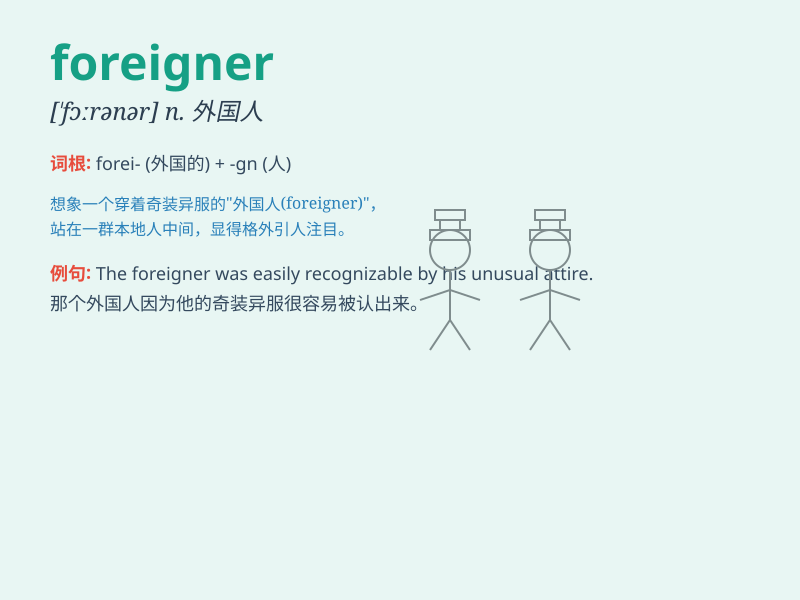

## foreigner

**英音:** _[\'fɒrɪnə]_ **美音:** _[\'fɔrənɚ]_

**译义:** *n.外国人,外地人*

### 短语

+ **foreign language:** _外语_

+ **foreign affairs:** _外交事务_

+ **foreign trade:** _对外贸易_

+ **foreign policy:** _外交政策_

+ **foreign student:** _外国学生_

### 例句

#### 例句1

> **I met a foreigner at the airport yesterday.**

**中文翻译:** 昨天我在机场遇到了一个外国人。

**单词释义:** 外国人

#### 例句2

> **The city attracts many foreigners every year.**

**中文翻译:** 这座城市每年都吸引着许多外国人。

**单词释义:** 外国人

#### 例句3

> **She has trouble communicating with foreigners.**

**中文翻译:** 她与外国人沟通有困难。

**单词释义:** 外国人

### 背诵小故事

> One day, I met a person in the park. He didn\'t look familiar and had
a different accent. I realized he was a foreigner. He was lost and
needed help to find his way. I was happy to assist him.

**有一天，我在公园遇到一个人。他看起来很陌生，口音也不同。我意识到他是个外国人。他迷路了，需要帮助找到路。我很乐意帮助他。**

### 图义

