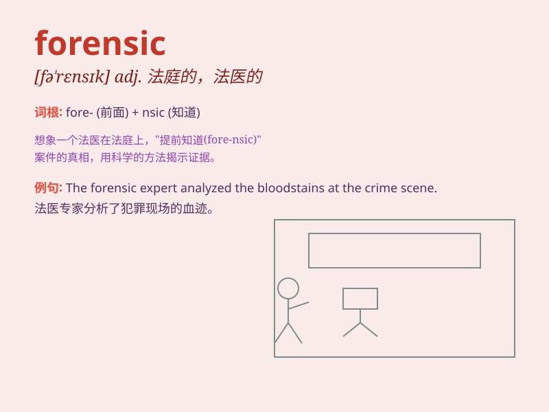

## forensic

**英音:** _[fə\'rensɪk]_ **美音:** _[fə\'rɛnsɪk]_

**译义:** *adj.法院的,适于法庭的,公开辩论的n.辩论术*

### 短语

+ **forensic science:** _法医学_

+ **forensic medicine:** _法医；法医学_

+ **forensic analysis:** _法医分析；司法鉴定分析_

+ **forensic evidence:** _法医证据；法庭证据_

+ **forensic expert:** _法医专家；司法鉴定专家_

### 例句

#### 例句1

> **Forensic experts were called to the crime scene.**

**中文翻译:** 法医专家被召集到犯罪现场。

**单词释义:** 法医的；法庭的

#### 例句2

> **The forensic analysis of the evidence was crucial for the
case.**

**中文翻译:** 证据的法医分析对于此案至关重要。

**单词释义:** 法医的；用于法庭的

#### 例句3

> **She has a background in forensic science.**

**中文翻译:** 她拥有法医学背景。

**单词释义:** 法医学的

### 背诵小故事

> A detective was working on a forensic case. He carefully examined the
crime scene, looking for forensic evidence like fingerprints and DNA.
With these clues, he was able to solve the mystery and catch the
criminal.

**一位侦探正在处理一个法医案件。他仔细检查犯罪现场，寻找指纹和 DNA
等法医证据。凭借这些线索，他得以解开谜团并抓住罪犯。**

### 图义

