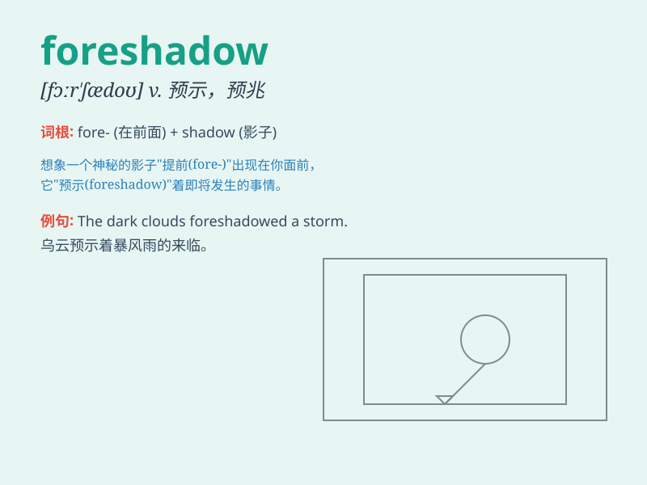

## foreshadow

**英音:** _[fɔː\'ʃædəʊ]_ **美音:** _[fɔr\'ʃædo]_

**译义:** *v.预示*

### 短语

+ **foreshadow disaster:** _预示灾难_

+ **foreshadow trouble:** _预示麻烦_

+ **foreshadow success:** _预示成功_

+ **foreshadow change:** _预示变化_

+ **foreshadow failure:** _预示失败_

### 例句

#### 例句1

> **The dark clouds foreshadowed a coming storm.**

**中文翻译:** 乌云密布，预示着暴风雨即将来临。

**单词释义:** 预示；预兆

#### 例句2

> **His early behavior foreshadowed his later problems.**

**中文翻译:** 他早期的行为预示了他后来的问题。

**单词释义:** 预示；预兆

#### 例句3

> **The opening scene of the movie foreshadowed the tragic
ending.**

**中文翻译:** 电影的开场就预示了悲惨的结局。

**单词释义:** 预示；预兆

### 背诵小故事

> A detective was solving a case. In the beginning, a strange symbol
foreshadowed a big conspiracy. Later, as expected, a series of
mysterious events occurred. The detective finally uncovered the truth
based on that early clue.

**一位侦探正在破案。一开始，一个奇怪的符号预示着一个巨大的阴谋。后来，不出所料，一系列神秘事件发生了。侦探最终根据那个早期的线索揭开了真相。**

### 图义

