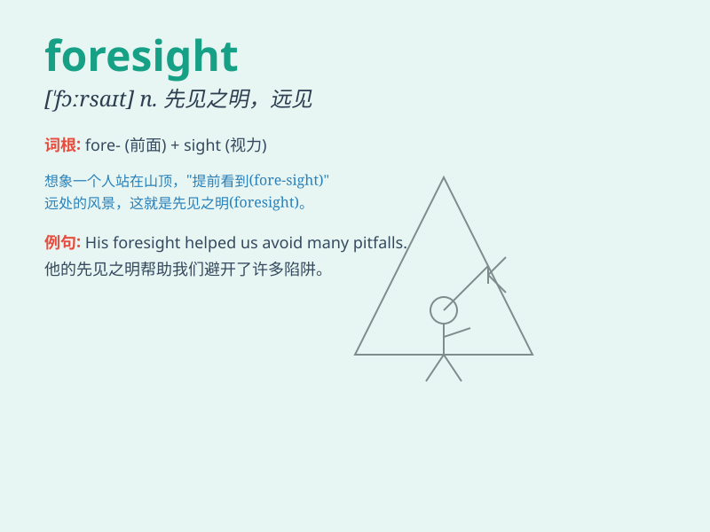

## foresight

**英音:** _[\'fɔːsaɪt]_ **美音:** _[\'fɔrsaɪt]_

**译义:** *n.远见,深谋远虑*

### 短语

+ **have foresight:** _有先见之明_

+ **lack foresight:** _缺乏远见_

+ **foresight planning:** _前瞻性规划_

+ **foresight strategy:** _远见策略_

+ **show foresight:** _表现出先见之明_

### 例句

#### 例句1

> **His foresight helped the company avoid a financial crisis.**

**中文翻译:** 他的远见帮助公司避免了财务危机。

**单词释义:** 先见之明；预见；深谋远虑

#### 例句2

> **The project was a success due to the leader\'s foresight.**

**中文翻译:** 由于领导的远见卓识，该项目取得了成功。

**单词释义:** 远见

#### 例句3

> **Lack of foresight can lead to many problems in the future.**

**中文翻译:** 缺乏远见可能会导致未来出现许多问题。

**单词释义:** 预见

### 背诵小故事

> A brave adventurer was lost in a forest. But he had foresight and
brought a map and compass. With them, he found his way out. Foresight
means the ability to predict and plan for the future.

**一位勇敢的探险家在森林中迷路了。但他有先见之明，带了地图和指南针。凭借这些，他找到了出路。foresight
意思是预见和为未来做计划的能力。**

### 图义

