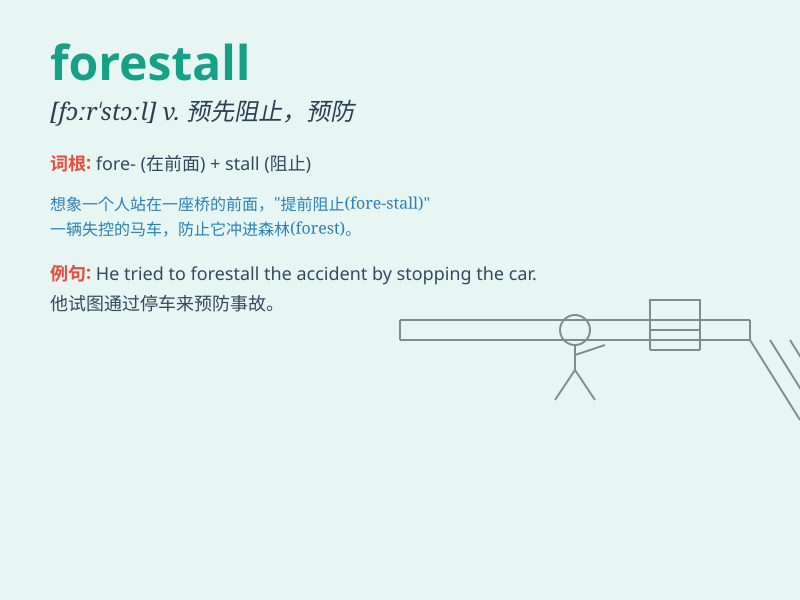

## forestall

**英音:** _[fɔːˈstɔːl]_ **美音:** _[fɔːrˈstɔːl]_

**译义:**
*vt.之前,先\...(用先发制人的方法)预防,阻止,囤积居奇,行动,用先发制人的方法预防,,垄断,阻碍*

### 短语

+ **forestall danger:** _预先阻止危险_

+ **forestall competition:** _预先阻止竞争_

+ **forestall a question:** _预先阻止一个问题_

+ **forestall an attack:** _预先阻止攻击_

+ **forestall trouble:** _预先阻止麻烦_

### 例句

#### 例句1

> **The company took measures to forestall the competition.**

**中文翻译:** 公司采取了阻止竞争的措施。

**单词释义:** 预先阻止；预先防止

#### 例句2

> **She tried to forestall his questions by changing the subject.**

**中文翻译:** 她试图通过改变话题来阻止他的问题。

**单词释义:** 预先阻止；抢先行动以阻止

#### 例句3

> **The police\'s actions forestalled a potential riot.**

**中文翻译:** 警方的行动阻止了潜在的骚乱。

**单词释义:** 预先防止；预防

### 背诵小故事

> A merchant was always worried about his rivals. To prevent them from
getting the best goods first, he would rise early every morning to
forestall them. This way, he could secure the best deals and stay ahead
in business.

**一位商人总是担心他的竞争对手。为了阻止他们先得到最好的货物，他每天早上都会早起抢先一步。这样，他就能确保获得最好的交易，并在生意上保持领先。**

### 图义

