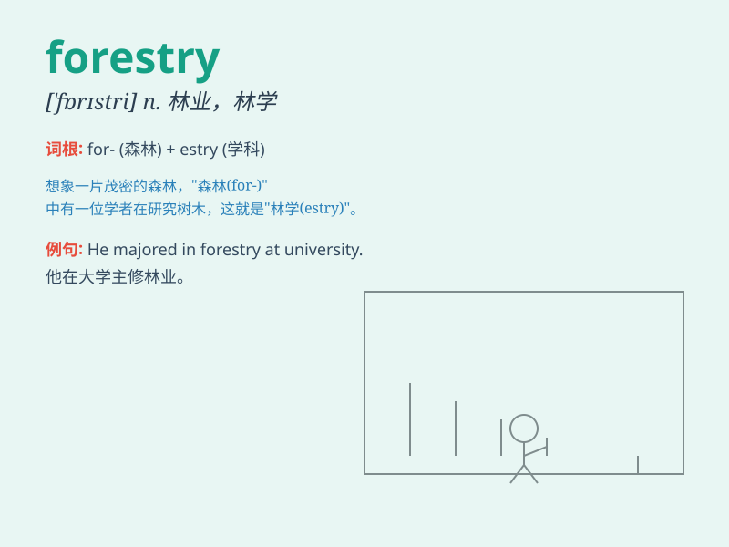

## forestry

**英音:** _[\'fɒrɪstrɪ]_ **美音:** _[\'fɔrɪstri]_

**译义:** *n.林产,森林地,林学*

### 短语

+ **forestry management:** _林业管理_

+ **sustainable forestry:** _可持续林业_

+ **forestry industry:** _林业产业_

+ **forestry research:** _林业研究_

+ **modern forestry:** _现代林业_

### 例句

#### 例句1

> **He studied forestry at university and now works as a forest
ranger.**

**中文翻译:** 他在大学学习林业，现在担任护林员。

**单词释义:** 林业

#### 例句2

> **Forestry is an important field for environmental protection.**

**中文翻译:** 林业是环境保护的重要领域。

**单词释义:** 林业

#### 例句3

> **The government is promoting sustainable forestry practices.**

**中文翻译:** 政府正在促进可持续林业实践。

**单词释义:** 林业

### 背诵小故事

> A young adventurer named Lily loved exploring the wild. One day, she
discovered a beautiful area filled with trees and learned it was managed
by something called \'forestry\'. It was all about taking care of the
forests and making them thrive.

**一位名叫莉莉的年轻冒险家喜欢探索野外。有一天，她发现了一个树木繁茂的美丽区域，并了解到这是由被称为"林业"的东西在管理。它关乎着对森林的照料并让它们茁壮成长。**

### 图义

