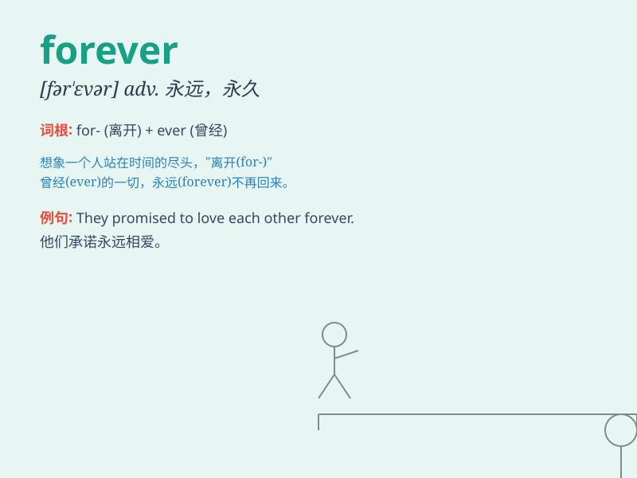

## forever

**英音:** _[fə\'revə]_ **美音:** _[fɚ\'ɛvɚ]_

**译义:** *adv.永远,永恒,永久,常常,始终*

### 短语

+ **forever and ever:** _永远，永久_

+ **love you forever:** _永远爱你_

+ **forever young:** _永远年轻_

+ **go on forever:** _永远继续下去_

+ **last forever:** _永远持续；永远存在_

### 例句

#### 例句1

> **I will love you forever.**

**中文翻译:** 我会永远爱你。

**单词释义:** 永远

#### 例句2

> **This moment will be remembered forever.**

**中文翻译:** 这一刻将被永远铭记。

**单词释义:** 永远

#### 例句3

> **She hopes to stay young forever.**

**中文翻译:** 她希望永远保持年轻。

**单词释义:** 永远

### 背诵小故事

> A prince and a princess promised to love each other forever. They
overcame many difficulties and never gave up. Their love lasted through
time, just like the meaning of \'forever\'.

**一位王子和一位公主承诺永远彼此相爱。他们克服了许多困难，从未放弃。他们的爱经久不衰，就像'forever'这个词的意思一样。**

### 图义

