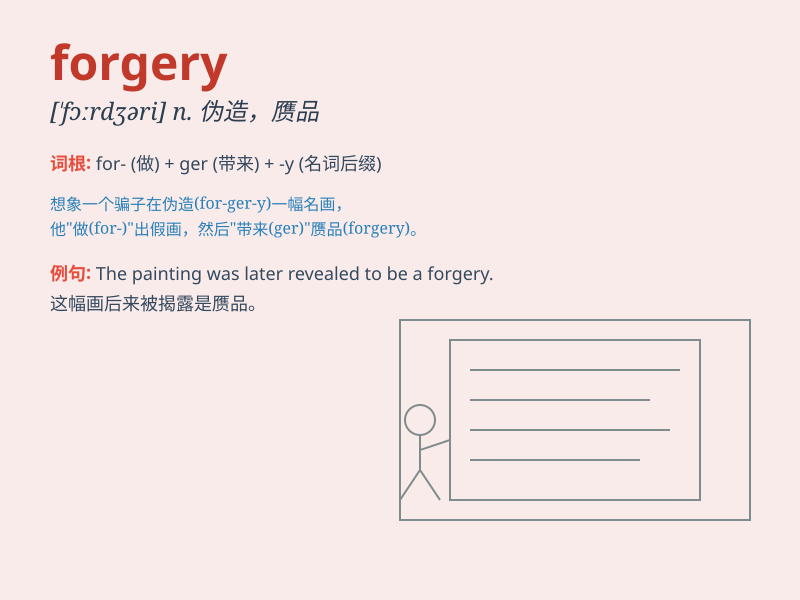

## forgery

**英音:** _[\'fɔːdʒ(ə)rɪ]_ **美音:** _[\'fɔrdʒəri]_

**译义:** *n.伪造物,伪造罪,伪造*

### 短语

+ **document forgery:** _文件伪造_

+ **art forgery:** _艺术品伪造_

+ **forgery crime:** _伪造罪_

+ **banknote forgery:** _钞票伪造_

+ **signature forgery:** _签名伪造_

### 例句

#### 例句1

> **The police discovered a forgery of an important document.**

**中文翻译:** 警方发现了一份重要文件的伪造品。

**单词释义:** 伪造，赝品

#### 例句2

> **He was accused of forgery and fraud.**

**中文翻译:** 他被指控伪造和欺诈。

**单词释义:** 伪造行为

#### 例句3

> **The expert identified the painting as a forgery.**

**中文翻译:** 专家鉴定这幅画是赝品。

**单词释义:** 赝品，伪造物

### 背诵小故事

> One day, a thief was caught trying to sell a valuable painting. It
turned out to be a forgery. He had copied the original masterpiece
poorly, thinking no one would notice. But the experts saw through his
trick.

**一天，一个小偷在试图出售一幅珍贵的画时被抓住了。原来这是一幅赝品。他拙劣地复制了原作，以为没人会注意到。但专家识破了他的诡计。**

### 图义

