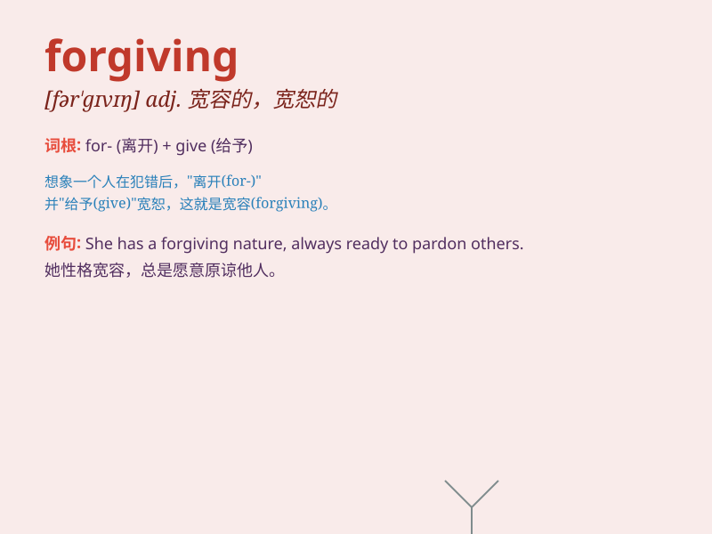

## forgiving

**英音:** _[fə\'gɪvɪŋ]_ **美音:** _[fɚ\'gɪvɪŋ]_

**译义:** *adj.宽大的,慈悲的*

### 短语

+ **be forgiving:** _宽容；原谅_

+ **forgiving nature:** _宽容的天性_

+ **forgiving heart:** _宽容的心_

+ **more forgiving:** _更宽容的_

+ **less forgiving:** _不那么宽容的_

### 例句

#### 例句1

> **She has a very forgiving nature and rarely holds a grudge.**

**中文翻译:** 她性格非常宽容，很少记仇。

**单词释义:** 宽容的；仁慈的

#### 例句2

> **It\'s important to be forgiving in a relationship.**

**中文翻译:** 在人际关系中保持宽容很重要。

**单词释义:** 宽容的；宽宏大量的

#### 例句3

> **The forgiving weather made our picnic very enjoyable.**

**中文翻译:** 晴朗的天气使我们的野餐非常愉快。

**单词释义:** 宜人的；温和的（此处为引申义）

### 背诵小故事

> One day, Tom accidentally broke Mary\'s favorite vase. But Mary was
forgiving. She didn\'t get angry and said it was okay. Tom was very
grateful for Mary\'s forgiving nature.

**有一天，汤姆不小心打碎了玛丽最喜欢的花瓶。但玛丽很宽容。她没有生气并说没关系。汤姆非常感激玛丽宽容的天性。**

### 图义

