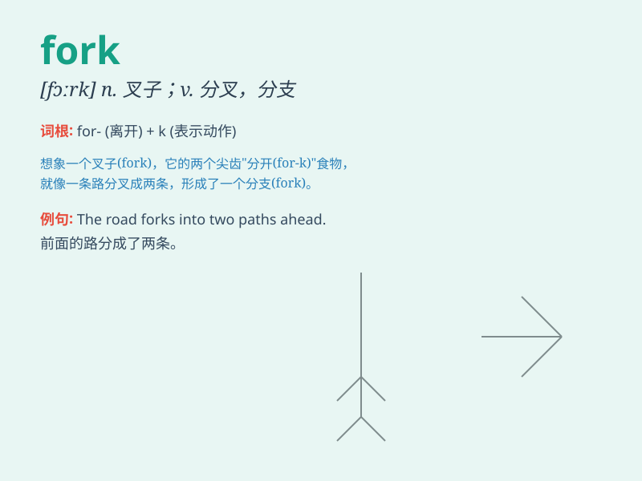

## fork

**英音:** _[fɔːk]_ **美音:** _[fɔrk]_

**译义:** *n.叉,耙,叉形物,餐叉*

### 短语

+ **fork out:** _支付；花费_

+ **fork over:** _交出；交付_

+ **tuning fork:** _音叉_

+ **fork in the road:** _岔路口；三岔路口_

+ **garden fork:** _园艺叉_

### 例句

#### 例句1

> **He used a fork to eat the salad.**

**中文翻译:** 他用叉子吃沙拉。

**单词释义:** 叉子（用作工具）

#### 例句2

> **The road forks ahead. **

**中文翻译:** 前面的路有岔路。

**单词释义:** 分岔（动词）

#### 例句3

> **She forked the hay in the barn.**

**中文翻译:** 她在谷仓里叉干草。

**单词释义:** 用叉子叉（动词）

### 背诵小故事

> One day, a hungry little rabbit was looking for food. Suddenly, it
saw a shiny fork on the ground. It wondered how this fork could help it
get delicious carrots. Then it realized it could use the fork to dig and
find carrots.

**一天，一只饥饿的小兔子正在找食物。突然，它看到地上有一把闪亮的叉子。它好奇这把叉子怎么能帮它弄到美味的胡萝卜。然后它意识到可以用叉子挖地找胡萝卜。**

### 图义

