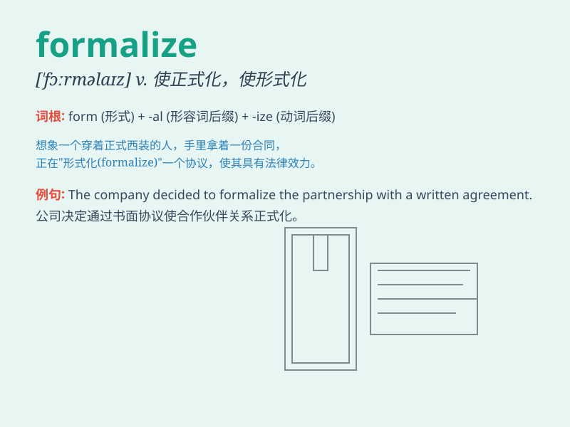

## formalize

**英音:** _[\'fɔːm(ə)laɪz]_ **美音:** _[\'fɔrməlaɪz]_

**译义:** *vt.使正式,形式化vi.拘泥于形式*

### 短语

+ **formalize the process:** _使过程正式化_

+ **formalize an agreement:** _使协议正式化_

+ **formalize the procedure:** _使程序正式化_

+ **formalize the relationship:** _使关系正式化_

+ **formalize the system:** _使系统正式化_

### 例句

#### 例句1

> **We need to formalize the process of recruitment.**

**中文翻译:** 我们需要正规化招聘流程。

**单词释义:** 使正式化；使形式化

#### 例句2

> **The company decided to formalize its partnership with the
supplier.**

**中文翻译:** 该公司决定与供应商正式建立合作伙伴关系。

**单词释义:** 使正式化；使形式化

#### 例句3

> **They are working to formalize the rules and regulations.**

**中文翻译:** 他们正在努力使规则和条例正式化。

**单词释义:** 使正式化；使形式化

### 背诵小故事

> A scientist wanted to formalize his wild ideas. He spent days writing
and organizing, making them clear and structured. Finally, his ideas
were formalized and ready to be shared with the world.

**一位科学家想要使他那些天马行空的想法正式化。他花了好几天时间书写和整理，让它们清晰且有条理。最终，他的想法被正式化，准备好与世界分享。**

### 图义

