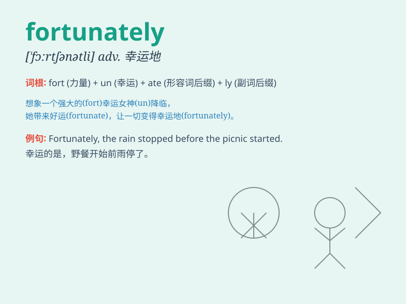

## fortunately

**英音:** _[ˈfɔːtʃənətli]_ **美音:** _[\'fɔrtʃənətli]_

**译义:** *adv.幸运地*

### 短语

+ **fortunately for sb:** _对某人来说幸运的是_

+ **fortunately enough:** _幸运的是；足够幸运_

+ **be fortunately situated:** _处境幸运_

+ **Fortunately, though:** _不过幸运的是_

+ **fortunately saved:** _幸运地获救_

### 例句

#### 例句1

> **Fortunately, the weather was fine for the picnic.**

**中文翻译:** 幸运的是，天气很好，适合野餐。

**单词释义:** 幸运地；幸亏

#### 例句2

> **Fortunately, I caught the train just in time.**

**中文翻译:** 幸运的是，我及时赶上了火车。

**单词释义:** 幸运地；幸好

#### 例句3

> **Fortunately, she was not injured in the accident.**

**中文翻译:** 幸运的是，她在事故中没有受伤。

**单词释义:** 幸运地；幸亏

### 背诵小故事

> A man was lost in a forest. He had no food or water. Fortunately, a
rescue team found him just in time. The word \'fortunately\' here means
luckily, showing a positive outcome in a difficult situation.

**一个男人在森林里迷路了。他没有食物和水。幸运的是，一支救援队及时找到了他。单词'fortunately'在这里的意思是幸运地，表明在困难的情况下有一个积极的结果。**

### 图义

