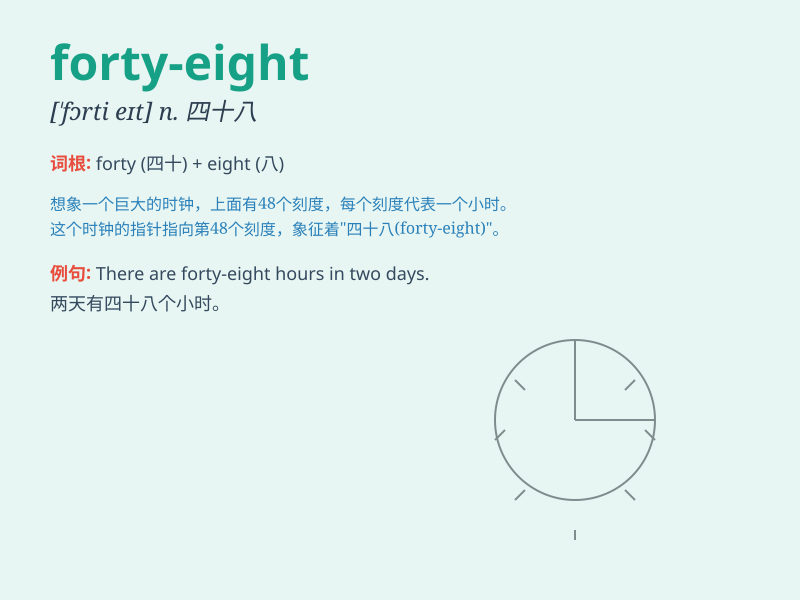

## forty-eight

**英音:** _[ˈfɔːti eɪt]_ **美音:** _[ˈfɔrti eɪt]_

**译义:** *num.四十八*

### 短语

+ **forty-eight hours:** _四十八小时_

+ **forty-eight people:** _四十八个人_

+ **forty-eight cars:** _四十八辆车_

+ **forty-eight books:** _四十八本书_

+ **forty-eight apples:** _四十八个苹果_

### 例句

#### 例句1

> **There are forty-eight students in our class.**

**中文翻译:** 我们班有四十八个学生。

**单词释义:** 四十八

#### 例句2

> **The price of this book is forty-eight yuan.**

**中文翻译:** 这本书的价格是四十八元。

**单词释义:** 四十八

#### 例句3

> **He has been working here for forty-eight months.**

**中文翻译:** 他已经在这里工作了四十八个月。

**单词释义:** 四十八

### 背诵小故事

> One day, I was on a treasure hunt. The clue said the treasure was
hidden at the forty-eighth step of an old staircase. I counted carefully
and finally found the precious box at step forty-eight.

**有一天，我在寻宝。线索说宝藏藏在一个旧楼梯的第四十八级台阶上。我仔细地数着，终于在第四十八级台阶上找到了珍贵的盒子。**

### 图义

