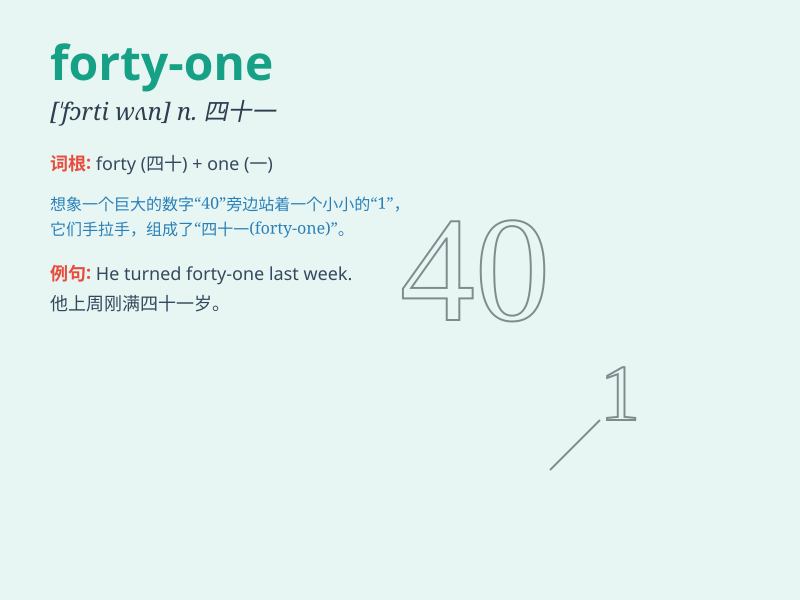

## forty-one

**英音:** _[ˈfɔːti wʌn]_ **美音:** _[ˈfɔrti wʌn]_

**译义:** *num.四十一*

### 短语

+ **forty-one years old:** _四十一岁_

+ **forty-one students:** _四十一名学生_

+ **forty-one books:** _四十一本书_

+ **forty-one kilometers:** _四十一公里_

+ **forty-one days:** _四十一天_

### 例句

#### 例句1

> **I am forty-one years old.**

**中文翻译:** 我四十一岁了。

**单词释义:** 四十一

#### 例句2

> **There are forty-one students in our class.**

**中文翻译:** 我们班有四十一名学生。

**单词释义:** 四十一

#### 例句3

> **The price of this book is forty-one yuan.**

**中文翻译:** 这本书的价格是四十一元。

**单词释义:** 四十一

### 背诵小故事

> One day, a little boy was counting. He reached forty and then added
one more. \'Forty-one!\' he shouted happily. It was his new record of
counting.

**一天，一个小男孩在数数。他数到了四十，然后又多了一个。"四十一！"他高兴地喊道。这是他数数的新纪录。**

### 图义

