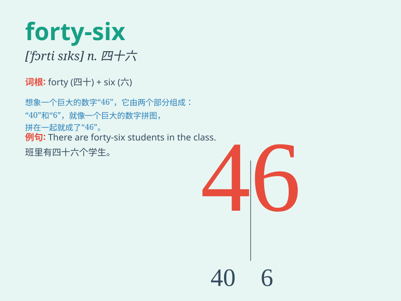

## forty-six

**英音:** _[\'fɔːtiː-sɪks]_ **美音:** _[\'fɔːrtiː-sɪks]_

**译义:** *四十六*

### 短语

+ **forty-six times:** _四十六次_

+ **forty-six people:** _四十六个人_

+ **forty-six years old:** _四十六岁_

+ **forty-six dollars:** _四十六美元_

+ **forty-six minutes:** _四十六分钟_

### 例句

#### 例句1

> **I\'m forty-six years old.**

**中文翻译:** 我四十六岁了。

**单词释义:** 四十六

#### 例句2

> **The book has forty-six pages.**

**中文翻译:** 这本书有四十六页。

**单词释义:** 四十六

#### 例句3

> **There are forty-six students in our class.**

**中文翻译:** 我们班有四十六个学生。

**单词释义:** 四十六

### 背诵小故事

> One day, a little monkey was trying to count. It counted from one to
forty-five smoothly, but then got stuck at forty-six. It scratched its
head and finally remembered after much effort.

**一天，一只小猴子正在努力数数。它从 1 顺利数到了 45，但在 46
这里卡住了。它挠挠头，费了好大劲终于记住了。**

### 图义

