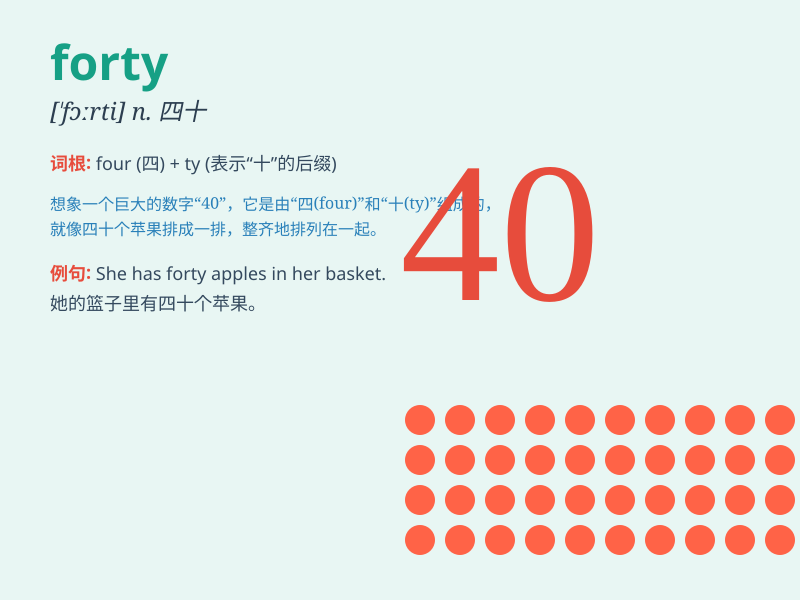

## forty

**英音:** _[\'fɔːtɪ]_ **美音:** _[\'fɔrti]_

**译义:** * num.四十,40n.四十岁*

### 短语

+ **forty winks:** _小睡；打盹_

+ **forty-niner:** _1849 年涌往加利福尼亚州淘金的人_

+ **forty thieves:** _四十大盗_

+ **in one\'s forties:** _在某人四十多岁时_

+ **forty days and forty nights:** _四十天四十夜_

### 例句

#### 例句1

> **There are forty students in our class.**

**中文翻译:** 我们班有四十名学生。

**单词释义:** 四十

#### 例句2

> **She is forty years old.**

**中文翻译:** 她四十岁了。

**单词释义:** 四十

#### 例句3

> **The price of this shirt is forty dollars.**

**中文翻译:** 这件衬衫的售价是四十美元。

**单词释义:** 四十

### 背诵小故事

> One day, a little monkey was trying to count apples. It counted and
counted, and finally it shouted, \'I have forty apples!\' It was so
happy because it had a big harvest.

**一天，一只小猴子在数苹果。它数啊数，最后喊道：'我有四十个苹果！'它非常高兴，因为收获很大。**

### 图义

