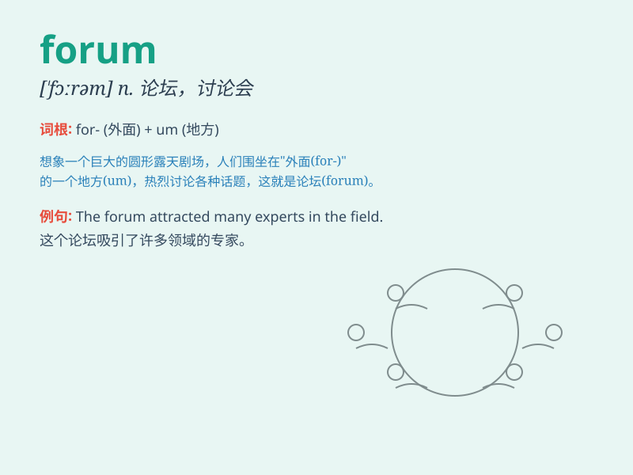

## forum

**英音:** _[\'fɔːrəm]_ **美音:** _[\'fɔrəm]_

**译义:** *n.古罗马城镇的广场(或市场),论坛,法庭,讨论会*

### 短语

+ **online forum:** _在线论坛_

+ **public forum:** _公共论坛_

+ **discussion forum:** _讨论论坛_

+ **academic forum:** _学术论坛_

+ **business forum:** _商业论坛_

### 例句

#### 例句1

> **The forum provided a platform for people to exchange ideas.**

**中文翻译:** 论坛为人们提供了交流思想的平台。

**单词释义:** 论坛；讨论会

#### 例句2

> **He often participates in online forums to learn new
knowledge.**

**中文翻译:** 他经常参加网上论坛来学习新知识。

**单词释义:** 论坛；讨论会

#### 例句3

> **The business forum attracted many entrepreneurs.**

**中文翻译:** 企业论坛吸引了众多企业家。

**单词释义:** 论坛；讨论会

### 背诵小故事

> In ancient Rome, people gathered in a special place called the
\'forum\' to discuss politics and share ideas. It was like a big meeting
hall. Imagine you are there, listening and speaking freely. So,
\'forum\' means a place for public discussion.

**在古罗马，人们在一个叫做'forum（论坛；公共讨论场所）'的特殊地方聚集，讨论政治并分享想法。它就像一个大的会议厅。想象你在那里，自由地倾听和发言。所以，'forum'指的是公共讨论的场所。**

### 图义

