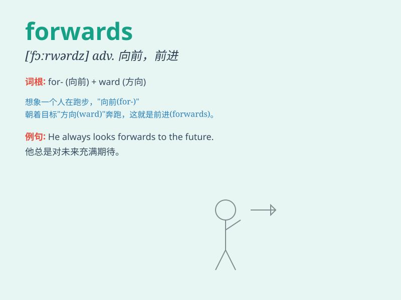

## forwards

**英音:** _[\'fɔːwədz]_ **美音:** _[\'fɔrwɚdz]_

**译义:** *adv.(=forward)向前方,继续向前*

### 短语

+ **move forwards:** _向前移动_

+ **step forwards:** _向前迈步_

+ **lean forwards:** _向前倾斜_

+ **look forwards:** _向前看_

+ **push forwards:** _向前推_

### 例句

#### 例句1

> **He moved forwards slowly.**

**中文翻译:** 他缓慢地向前走去。

**单词释义:** 向前

#### 例句2

> **The team is looking forwards to the championship game.**

**中文翻译:** 球队对冠军赛充满期待。

**单词释义:** 期待

#### 例句3

> **She leaned forwards to get a better view.**

**中文翻译:** 她身体前倾，以便看得更清楚。

**单词释义:** 向前

### 背诵小故事

> One day, a little boy was lost in a forest. He wanted to go home. A
kind bird told him to walk forwards. So he did and finally found his way
out.

**一天，一个小男孩在森林里迷路了。他想回家。一只善良的鸟告诉他向前走。于是他照做了，最终找到了出去的路。**

### 图义

