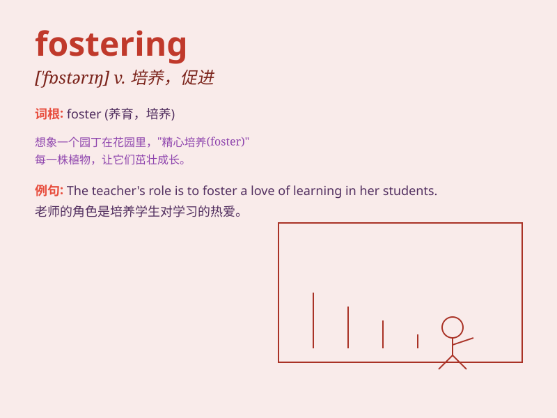

## fostering

**英音:** _[ˈfɒstərɪŋ]_ **美音:** _[ˈfɔːstərɪŋ]_

**译义:**
*促进，培养（某人的成长、发展等）；养育，抚养；怀有（希望、抱负等）*

### 短语

+ **fostering care:** _寄养照顾_

+ **fostering environment:** _培育环境_

+ **fostering development:** _促进发展_

+ **fostering innovation:** _培养创新_

+ **fostering talent:** _培养人才_

### 例句

#### 例句1

> **The government is committed to fostering economic growth.**

**中文翻译:** 政府致力于促进经济增长。

**单词释义:** 促进；助长

#### 例句2

> **Fostering a sense of community among students is important for
the school.**

**中文翻译:** 在学生中培养社区意识对学校来说很重要。

**单词释义:** 培养；培育

#### 例句3

> **She spent years fostering the child\'s talent in music.**

**中文翻译:** 她花了多年时间培养孩子在音乐方面的天赋。

**单词释义:** 培养；鼓励

### 背诵小故事

> A kind woman was fostering a little kitten. She gave it love and care
every day, making the kitten grow strong and happy. \'Fostering\' means
taking care of and helping something or someone grow and develop.

**一位善良的女士正在抚养一只小猫。她每天都给予它关爱，让小猫茁壮成长并快乐起来。\'fostering\'意思是照顾并帮助某物或某人成长和发展。**

### 图义

