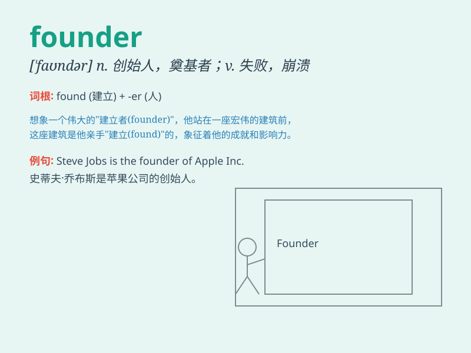

## founder

**英音:** _[\'faʊndə(r)]_ **美音:** _[\'faʊndɚ]_

**译义:**
*n.铸工,翻沙工,创始人,奠基人vt.使沉没,使摔倒,弄跛,浸水,破坏vi.沉没,摔到,变跛,倒塌,失败
方正集团,中国最著名的电子照排系统的生产商*

### 短语

+ **founder member:** _创始成员_

+ **founder effect:** _奠基者效应_

+ **company founder:** _公司创始人_

+ **project founder:** _项目创始人_

+ **founder stock:** _创始人股票_

### 例句

#### 例句1

> **The ship hit an iceberg and foundered.**

**中文翻译:** 船撞上冰山而沉没。

**单词释义:** 沉没

#### 例句2

> **The project foundered due to lack of funds.**

**中文翻译:** 该项目因缺乏资金而失败。

**单词释义:** 失败；破产

#### 例句3

> **The horse foundered in the deep mud.**

**中文翻译:** 那匹马陷在深深的泥里。

**单词释义:** （因蹄陷入软地等）挣扎得筋疲力尽

### 背诵小故事

>
想象一个勇敢的创业者，他满怀激情地创办了一家公司。然而，市场变化莫测，困难重重，最终他的公司没能挺住，倒闭了。这个创业者就像单词founder一样，遭遇了失败、沉没。

**想象一位勇敢的创业者，因公司倒闭就像单词founder所表示的失败、沉没，来辅助记忆这个词**

### 图义

