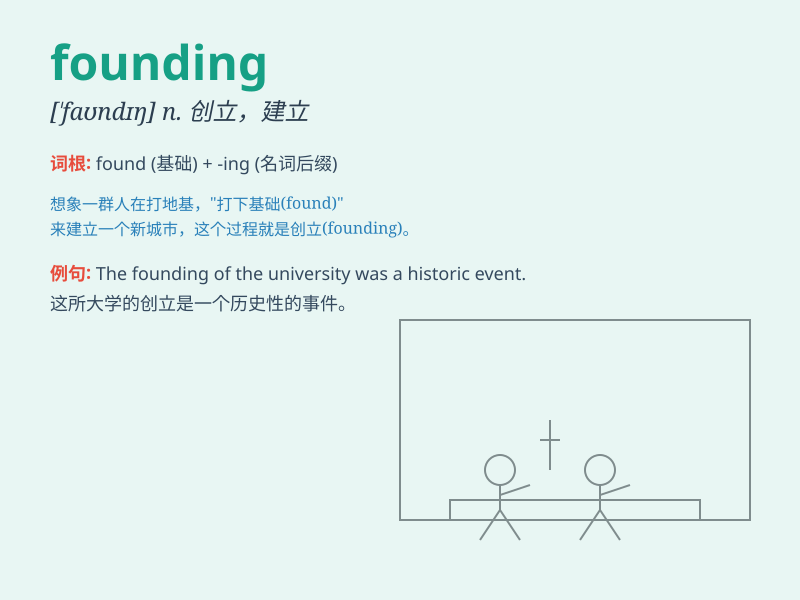

## founding

**英音:** _[ˈfaʊndɪŋ]_ **美音:** _[ˈfaʊndɪŋ]_

**译义:** *n.
创立，建立；成立；创办；（Founding）（英）方丁（人名）*

### 短语

+ **founding father:** _开国元勋；创建人_

+ **founding member:** _创始成员；创办会员_

+ **founding principle:** _基本原则；创立原则_

+ **founding document:** _创始文件；成立文件_

+ **founding stock:** _原始股；创办股_

### 例句

#### 例句1

> **The founding of the company was a significant event.**

**中文翻译:** 公司的创立是一个重要的事件。

**单词释义:** 创立；建立

#### 例句2

> **He was one of the founding members of the club.**

**中文翻译:** 他是这个俱乐部的创始成员之一。

**单词释义:** 创始的；创办的

#### 例句3

> **The founding principles of this organization still hold true
today.**

**中文翻译:** 这个组织的创始原则在今天仍然适用。

**单词释义:** 基础的；基本的

### 背诵小故事

> A group of passionate friends had a dream of starting a unique
company. The process of establishing it was full of challenges. They
called this beginning stage the \'founding\' period, which marked the
start of their great adventure.

**一群充满激情的朋友有一个创办一家独特公司的梦想。建立它的过程充满了挑战。他们把这个开始阶段称为\'创立\'时期，这标志着他们伟大冒险的开始。**

### 图义

