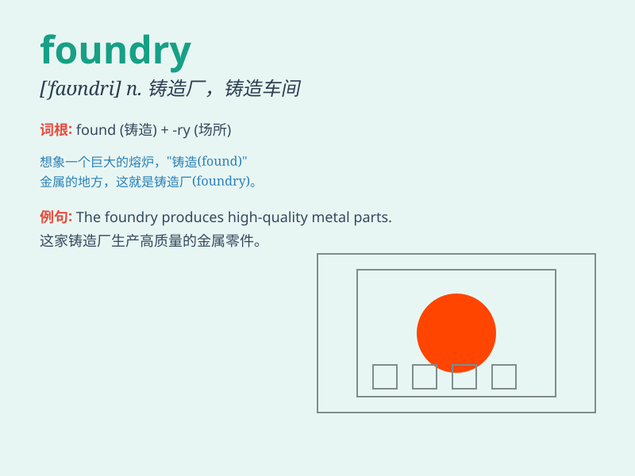

## foundry

**英音:** _[\'faʊndrɪ]_ **美音:** _[\'faʊndri]_

**译义:** *n.铸造,翻砂,铸工厂,玻璃厂,铸造厂*

### 短语

+ **steel foundry:** _铸钢厂_

+ **iron foundry:** _铸铁厂_

+ **foundry worker:** _铸造工人_

+ **foundry equipment:** _铸造设备_

+ **foundry sand:** _铸造用砂_

### 例句

#### 例句1

> **The foundry produces high-quality castings for the automotive
industry.**

**中文翻译:** 该铸造厂为汽车行业生产高质量铸件。

**单词释义:** 铸造厂

#### 例句2

> **He got a job at the local foundry after graduating from technical
school.**

**中文翻译:** 技校毕业后，他在当地铸造厂找到了一份工作。

**单词释义:** 铸造厂

#### 例句3

> **The old foundry was converted into an art gallery.**

**中文翻译:** 旧铸造厂改建为美术馆。

**单词释义:** 铸造厂

### 背诵小故事

> A long time ago, a smart man named Tom wanted to start a business. He
chose to build a foundry where he could melt metals and create wonderful
things like bells and statues. With hard work, his foundry became
famous.

**很久以前，一个叫汤姆的聪明人想要创业。他选择建一个铸造厂，在那里他可以熔化金属并制造像铃铛和雕像这样的好东西。通过努力，他的铸造厂出名了。**

### 图义

